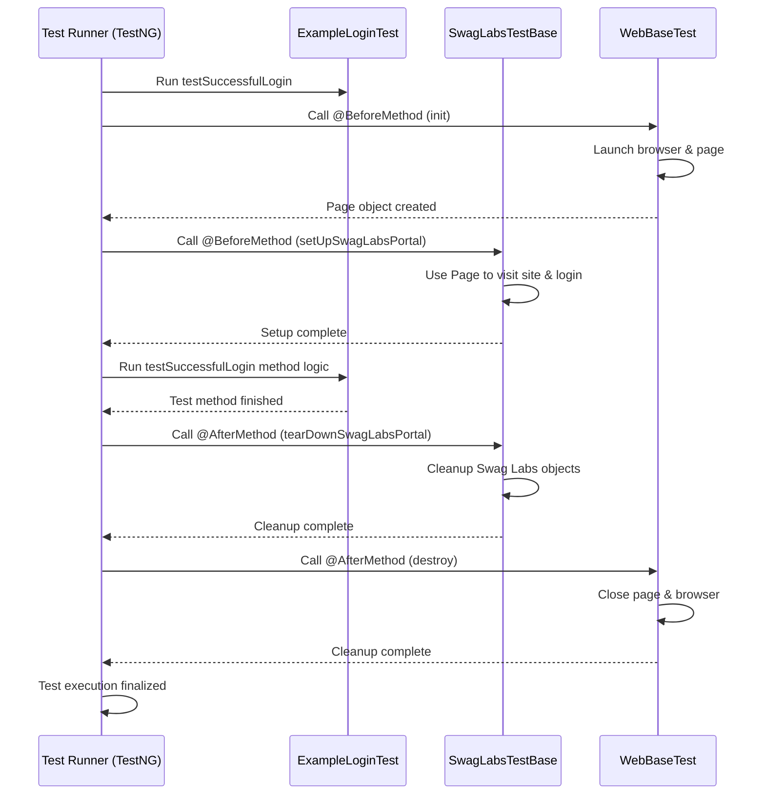
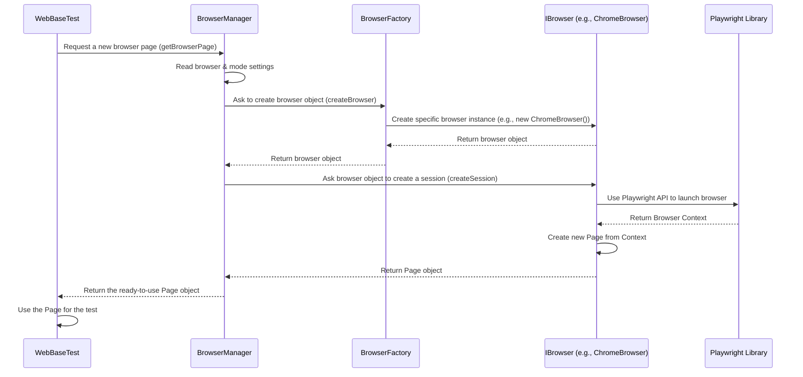
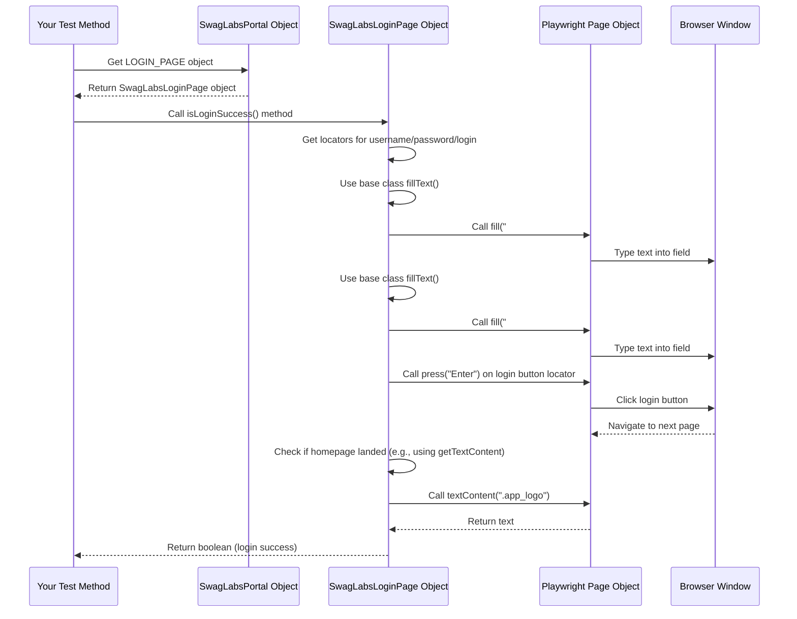
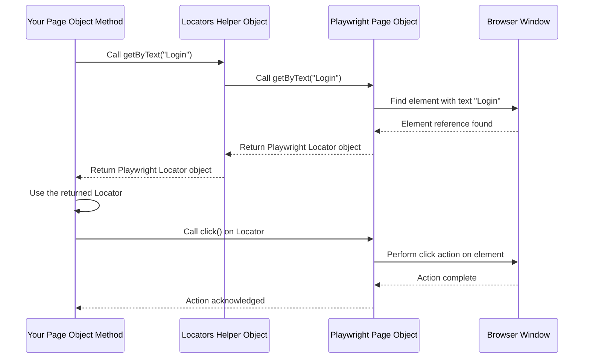
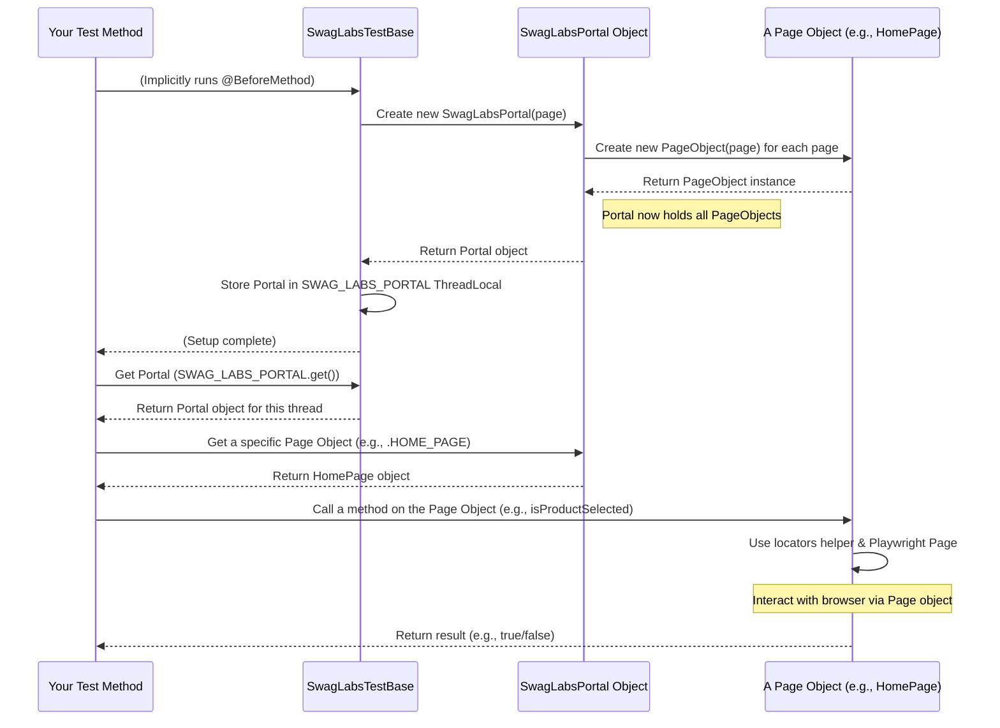
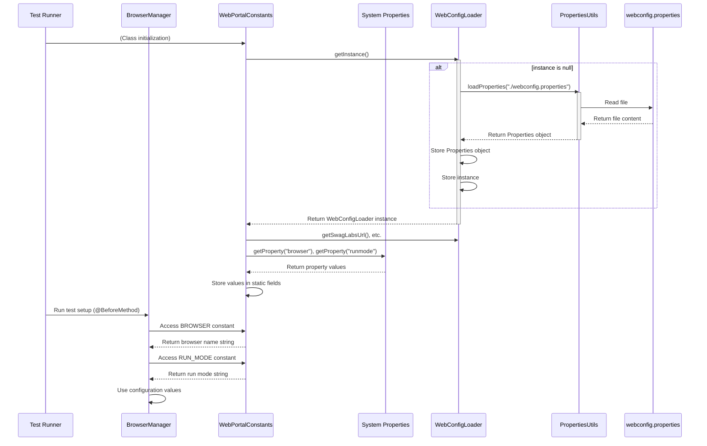
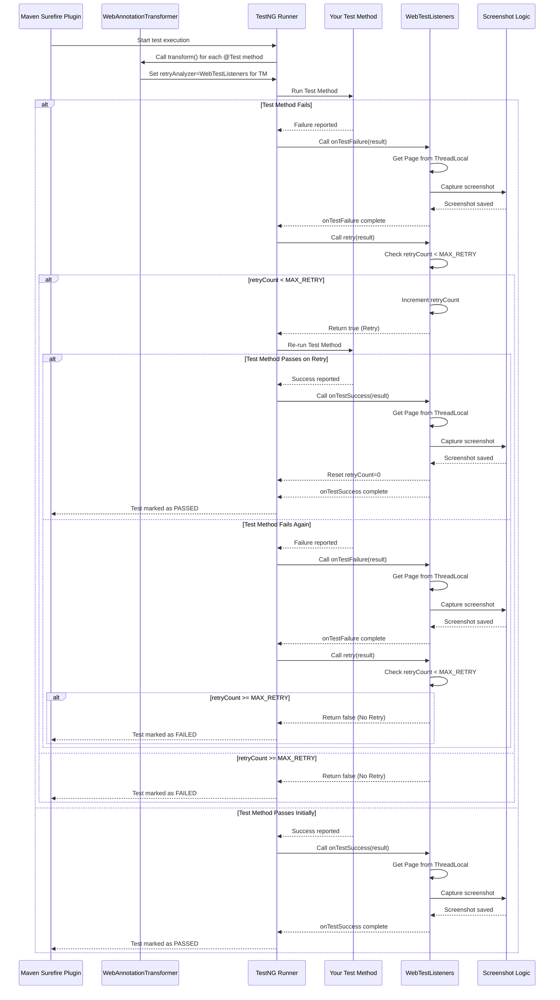
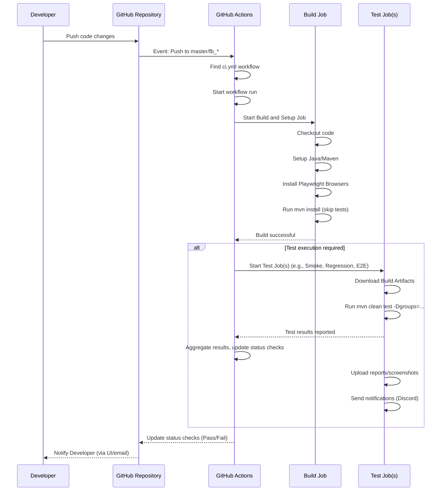

[](https://github.com/iamcharankumar/playwright_test_framework/actions/workflows/ci.yml)
[](https://github.com/iamcharankumar/playwright_test_framework/actions/workflows/codeql.yml)
[](https://codecov.io/gh/iamcharankumar/playwright_test_framework)

# ABOUT

Automated end-to-end testing framework built with Playwright and Java, tailored for any website. Designed
for scalability and maintainability, this framework covers critical test scenarios with robust assertions and clean,
modular code. Perfect for those looking to speed up their test automation journey or enhance their Playwright skills!

Thanks to [The Pocket](https://github.com/The-Pocket/PocketFlow-Tutorial-Codebase-Knowledge) for beautifully generating an entire easy-to-understand tutorial for this GitHub Repo.
Massive respect for creating such a wonderful tool. Simply Brilliant! ❤️

You can read the entire tutorial [here](https://code2tutorial.com/tutorial/81c3753d-35c2-41fd-941c-34a1c851e80c/index.md).
If the link doesn't work, please continue to read below.

# TEST ARCHITECTURE


# Chapter 1: Test Base Classes

Welcome to the first chapter of the `playwright_test_framework` tutorial!

When you write automated tests for a website, you often need to do the same things before *every single test*. Imagine you're testing the Swag Labs website. For almost every test (like adding items to the cart, checking out, etc.), you'll need to:

1.  Open a web browser.
2.  Go to the Swag Labs website.
3.  Log in with a valid user.

And after each test finishes, you'll want to clean up, like closing the browser.

Doing these steps manually for every test method would be very repetitive and make your tests long and messy. This is where **Test Base Classes** come in!

## What are Test Base Classes?

Think of Test Base Classes as **"test run coordinators"**. They are special classes designed to handle common setup and cleanup tasks for your tests automatically. Instead of writing the setup and cleanup code in every test file, you write it once in a base class, and your test classes *inherit* from it.

This framework provides two main base classes for web tests:

1.  **`WebBaseTest`**: This is the most fundamental base class for any web testing. It handles the absolute essentials, like:
    *   Launching a browser and creating a new browser page before each test.
    *   Closing the browser and page after each test.
    *   Setting up things like browser logs if needed (more on this in later chapters).
2.  **`SwagLabsTestBase`**: This class is designed specifically for testing the Swag Labs application. It **extends** `WebBaseTest` (meaning it includes all the features of `WebBaseTest`) and adds Swag Labs-specific setup:
    *   Visiting the Swag Labs website.
    *   Logging in a user automatically before each test.

By using these base classes, your actual test methods become much simpler. They only need to focus on the specific actions and checks for the test scenario itself, not the repetitive setup steps.

## How to Use Test Base Classes

To use these base classes, your test class simply needs to **inherit** from the relevant base class. Since `SwagLabsTestBase` handles the browser setup *and* Swag Labs login, you'll inherit from `SwagLabsTestBase` for your Swag Labs tests.

Let's look at a simplified example of how a test class structure might look (you won't see the full test logic here, just the basic structure):

```java
package io.swaglabs.portal.qa.testcases;

import org.testng.annotations.Test;

// Our test class inherits from SwagLabsTestBase
public class ExampleLoginTest extends SwagLabsTestBase {

    @Test
    public void testSuccessfulLogin() {
        // Because we inherited from SwagLabsTestBase,
        // the browser is already open, the page is ready,
        // AND we are already logged in!

        // Now, we can focus ONLY on testing login behavior
        // (even though we logged in via base class, we could
        // add specific checks here or focus on post-login features)

        System.out.println("Inside testSuccessfulLogin test method.");
        // ... add your specific login test steps or assertions here ...

        // The cleanup (logging out, closing browser) will be
        // handled automatically by the base classes after this method finishes.
    }

    // You can add more test methods here,
    // and each one will get the same setup (browser, login)
    // and cleanup (logout, close browser) automatically.
}
```

**Explanation:**

*   Notice `ExampleLoginTest extends SwagLabsTestBase`. This is the key! It means `ExampleLoginTest` gets all the setup and cleanup logic defined in `SwagLabsTestBase` (which in turn gets logic from `WebBaseTest`).
*   The `@Test` method `testSuccessfulLogin` is where your actual test steps go.
*   When this test runs, the base classes perform the setup *before* `testSuccessfulLogin` starts and the cleanup *after* it finishes. You don't need to write `openBrowser()`, `goToSwagLabs()`, `login()` in `testSuccessfulLogin` itself.

This makes your test methods cleaner, more readable, and easier to maintain!

## What Happens "Under the Hood"?

Let's see how the base classes coordinate the test run. This framework uses TestNG as its test runner, which provides annotations like `@BeforeMethod` and `@AfterMethod`. These annotations tell TestNG to run specific methods *before* or *after* each test method (`@Test`).

Here's a simplified sequence of what happens when `ExampleLoginTest.testSuccessfulLogin` runs:

1.  **Test Runner Starts:** TestNG prepares to run `testSuccessfulLogin`.
2.  **Base Class Setup (WebBaseTest):** TestNG sees that `ExampleLoginTest` inherits from `SwagLabsTestBase`, which inherits from `WebBaseTest`. It runs the `@BeforeMethod` in `WebBaseTest`.
    *   This method initializes Playwright, starts a browser, and gets a `Page` object. This `Page` object represents the tab in the browser you'll interact with.
3.  **Base Class Setup (SwagLabsTestBase):** Next, TestNG runs the `@BeforeMethod` in `SwagLabsTestBase`.
    *   This method uses the `Page` object from `WebBaseTest` to create a `SwagLabsPortal` object (we'll learn more about this in [Chapter 5: SwagLabsPortal (Module)](05_swaglabsportal__module__.md)).
    *   It then uses the `SwagLabsPortal` object to visit the website and perform the login steps.
    *   It checks if the login was successful.
4.  **Your Test Method Runs:** Now that the browser is open, the page is ready, and you are logged in, TestNG runs your `ExampleLoginTest.testSuccessfulLogin` method. You perform your test actions and assertions here.
5.  **Base Class Cleanup (SwagLabsTestBase):** After `testSuccessfulLogin` finishes, TestNG runs the `@AfterMethod` in `SwagLabsTestBase`.
    *   This method performs any necessary cleanup specific to the Swag Labs portal (though in this simple case, it mainly removes the `SwagLabsPortal` object reference).
6.  **Base Class Cleanup (WebBaseTest):** Finally, TestNG runs the `@AfterMethod` in `WebBaseTest`.
    *   This method closes the browser page, the browser, and Playwright resources, freeing up system resources.

Here's a simple diagram illustrating the flow:



### Looking at the Code (Simplified)

Let's peek at the core parts of the base classes that handle the setup and cleanup using `@BeforeMethod` and `@AfterMethod`.

**`WebBaseTest.java` (Simplified Setup)**

```java
// File: src/test/java/io/swaglabs/portal/qa/commons/WebBaseTest.java
package io.swaglabs.portal.qa.commons;

import com.microsoft.playwright.Page;
import com.microsoft.playwright.Playwright;
// ... other imports ...

public abstract class WebBaseTest {

    // This holds the browser page for the current test thread
    protected static ThreadLocal<Page> page = new ThreadLocal<>();
    // This holds the Playwright instance for the current test thread
    private static final ThreadLocal<Playwright> PLAYWRIGHT = new ThreadLocal<>();
    private static BrowserManager browserManager; // Manages browser details

    // Runs ONCE before ANY test method starts in the suite
    @BeforeSuite(alwaysRun = true)
    public void setUp() {
        browserManager = new BrowserManager();
        // ... logging ...
    }

    // Runs BEFORE EACH test method
    @BeforeMethod(alwaysRun = true)
    public void init(Method method) {
        PLAYWRIGHT.set(Playwright.create()); // Start Playwright
        // Get a browser page using BrowserManager (more in next chapter!)
        page.set(browserManager.getBrowserPage(PLAYWRIGHT.get()));
        // ... other setup like CDP logs (advanced, ignore for now) ...
    }

    // Runs AFTER EACH test method
    @AfterMethod(alwaysRun = true)
    public void destroy() {
        // ... cleanup like CDP sessions ...
        browserManager.destroyBrowserPage(page.get()); // Close the page
        page.remove(); // Remove page reference for this thread
        PLAYWRIGHT.get().close(); // Close Playwright
        PLAYWRIGHT.remove(); // Remove Playwright reference for this thread
        // ... logging ...
    }

    // ... other methods ...
}
```

**Explanation:**

*   `@BeforeSuite setUp()`: Runs once when TestNG starts the whole test run. It sets up the `browserManager`.
*   `@BeforeMethod init()`: This is crucial. It runs before *every single test method*. It creates a new Playwright instance and opens a fresh browser page specifically for that test method. The `page` variable holds the browser page that your test code will use.
*   `@AfterMethod destroy()`: Runs after *every single test method*. It's responsible for closing the page and the Playwright instance, cleaning up the resources used by the browser.

**`SwagLabsTestBase.java` (Simplified Setup)**

```java
// File: src/test/java/io/swaglabs/portal/qa/testcases/SwagLabsTestBase.java
package io.swaglabs.portal.qa.testcases;

// Inherits from WebBaseTest
import io.swaglabs.portal.qa.commons.WebBaseTest;
// Imports for Swag Labs module and logging
import io.swaglabs.portal.qa.module.SwagLabsPortal;
// ... other imports ...

// This class extends WebBaseTest
public sealed class SwagLabsTestBase extends WebBaseTest permits SwagLabsE2ETest, SwagLabsHomePageTest, SwagLabsLoginPageTest {

    // This holds the SwagLabsPortal object for the current test thread
    protected static final ThreadLocal<SwagLabsPortal> SWAG_LABS_PORTAL = new ThreadLocal<>();

    // Runs BEFORE EACH test method (AFTER WebBaseTest's @BeforeMethod)
    @BeforeMethod(alwaysRun = true)
    public void setUpSwagLabsPortal(Method method) {
        // Use the page object created by WebBaseTest
        SWAG_LABS_PORTAL.set(new SwagLabsPortal(page.get()));
        SWAG_LABS_PORTAL.get().visit(); // Visit Swag Labs site
        // Perform login steps using the module objects (more in Chapter 5)
        boolean isLoggedIn = SWAG_LABS_PORTAL.get().LOGIN_PAGE.isLoginSuccess();
        if (!isLoggedIn)
            throw new WebPageException("Swags Labs Portal Not Logged In!"); // Fail fast if login fails
        // ... logging ...
    }

    // Runs AFTER EACH test method (BEFORE WebBaseTest's @AfterMethod)
    @AfterMethod(alwaysRun = true)
    public void tearDownSwagLabsPortal(Method method) {
        // Remove the SwagLabsPortal object reference
        SWAG_LABS_PORTAL.remove();
        // ... logging ...
    }
}
```

**Explanation:**

*   `extends WebBaseTest`: This line is key. It means `SwagLabsTestBase` inherits and runs the `@BeforeMethod` and `@AfterMethod` from `WebBaseTest` as well.
*   `@BeforeMethod setUpSwagLabsPortal()`: This runs after the `WebBaseTest` setup. It takes the browser `page` provided by `WebBaseTest` and uses it to initialize the `SwagLabsPortal` object. It then calls methods on this object to visit the site and log in.
*   `@AfterMethod tearDownSwagLabsPortal()`: This runs before the `WebBaseTest` cleanup. It cleans up the `SwagLabsPortal` object reference.

The TestNG framework ensures that the `@BeforeMethod` methods from parent classes (`WebBaseTest`) run *before* the `@BeforeMethod` methods in the child class (`SwagLabsTestBase`), and `@AfterMethod` methods in the child class run *before* those in the parent class. This ensures the setup is done in the correct order (browser -> application setup) and cleanup is done in the reverse order (application cleanup -> browser cleanup).

## Summary

Test Base Classes like `WebBaseTest` and `SwagLabsTestBase` are powerful tools that centralize the common setup and cleanup logic for your web tests.

| Base Class         | Main Role                                    | What it handles                                      |
| :----------------- | :------------------------------------------- | :--------------------------------------------------- |
| `WebBaseTest`      | General Web Test Coordination                | Launching/closing browser and page (`@BeforeMethod`, `@AfterMethod`) |
| `SwagLabsTestBase` | Swag Labs Specific Test Coordination         | Extends `WebBaseTest`. Visits Swag Labs, logs in (`@BeforeMethod`). |

By having your test classes inherit from `SwagLabsTestBase`, you keep your actual test methods focused on testing the application's features, not on repetitive setup code.

Now that you understand how base classes set up and tear down the environment, let's dive into how the browser itself is managed.

# Chapter 2: Browser Management

Welcome back! In [Chapter 1: Test Base Classes](01_test_base_classes_.md), we learned how base classes like `WebBaseTest` and `SwagLabsTestBase` automatically handle the setup and cleanup for our tests, saving us from writing repetitive code. We saw that `WebBaseTest` is responsible for launching and closing the browser *before* and *after* each test method runs.

But how does `WebBaseTest` actually *get* a browser? What if you want to run your tests in Chrome sometimes, Firefox other times, or even run them without seeing the browser window pop up (headless mode)? This is where **Browser Management** comes in.

## What is Browser Management?

Think of Browser Management as having a dedicated **"browser request service"** within your test framework. Its job is solely to provide you with a ready-to-use web browser page (a tab) whenever you need one, specifically configured based on your test settings.

Why do we need a special system for this?

*   **Different Browsers:** You might want to test in Chrome, Firefox, Edge, or Safari (Webkit). The system needs to know which one to launch.
*   **Different Modes:** You might run tests visibly while developing (useful for debugging) or hidden ("headless") for faster execution in a pipeline. The system needs to handle this setting.
*   **Consistency:** Every test should start with a clean, fresh browser page to ensure tests don't interfere with each other.
*   **Centralized Logic:** If you need to set specific browser options (like screen size, permissions), you want to do it in one place, not scattered across your tests.

The `BrowserManager` and its helper classes provide this centralized, configurable way to handle browser instances.

## The Core Components

The Browser Management system in this framework involves a few key players working together:

1.  **`BrowserManager`**: This is the main orchestrator. When the `WebBaseTest` needs a browser page, it asks the `BrowserManager`. The `BrowserManager` reads the desired browser and run mode settings and uses a `BrowserFactory` to get the right browser instance. It then opens a new `Page` (a browser tab) within that browser instance and gives it back to the test. It's also responsible for closing the page later.
2.  **`BrowserFactory`**: This class acts like a selective creator. You tell it the *name* of the browser you want (like "chrome" or "firefox"), and it knows *how* to create the specific object (`ChromeBrowser`, `FirefoxBrowser`, etc.) that represents that browser type's logic.
3.  **`IBrowser`**: This is an interface (a blueprint) that defines what *any* specific browser type must be able to do. In this case, it defines the ability to `createSession`, which means launching the browser and setting up a new browser context (like an incognito window). All specific browser classes (`ChromeBrowser`, `FirefoxBrowser`, etc.) implement this interface.
4.  **Specific Browser Implementations (`ChromeBrowser`, `FirefoxBrowser`, etc.)**: These classes contain the actual Playwright code needed to launch a specific browser type with given options (like headless mode).
5.  **`BrowserName` (Enum)**: A simple list of valid browser names (like CHROME, FIREFOX). Using an enum helps prevent typos when specifying browser names.

Let's visualize how `WebBaseTest` uses the `BrowserManager` to get a browser page:



## How it's Used (by Base Classes)

As mentioned, you (as the test writer) don't typically call `BrowserManager` directly in your test methods. The base class, `WebBaseTest`, handles this for you automatically in its `@BeforeMethod` and `@AfterMethod`.

Let's revisit a simplified snippet from `WebBaseTest` that shows the interaction:

```java
// Simplified from src/test/java/io/swaglabs/portal/qa/commons/WebBaseTest.java

public abstract class WebBaseTest {

    protected static ThreadLocal<Page> page = new ThreadLocal<>(); // Holds the Page for the current test
    private static BrowserManager browserManager; // The browser request service

    // Runs ONCE before the test suite
    @BeforeSuite(alwaysRun = true)
    public void setUp() {
        browserManager = new BrowserManager(); // Create the manager once
        // ... other setup ...
    }

    // Runs BEFORE EACH test method
    @BeforeMethod(alwaysRun = true)
    public void init(Method method) {
        // 1. Start Playwright for this test thread
        Playwright playwright = Playwright.create();
        // 2. Ask the BrowserManager for a new Page!
        Page newPage = browserManager.getBrowserPage(playwright);
        // 3. Store the Page in ThreadLocal so the test can access it
        page.set(newPage);
        // ... other setup ...
    }

    // Runs AFTER EACH test method
    @AfterMethod(alwaysRun = true)
    public void destroy() {
        // ... cleanup ...
        // 1. Ask the BrowserManager to close the Page
        browserManager.destroyBrowserPage(page.get());
        // 2. Remove the Page reference for this thread
        page.remove();
        // 3. Close the Playwright instance
        // ... get Playwright from ThreadLocal ...
        // playwright.close();
        // ... remove Playwright reference ...
        // ... logging ...
    }
    // ... other methods ...
}
```

**Explanation:**

*   In `init()` (the `@BeforeMethod`), `WebBaseTest` creates a Playwright instance and then calls `browserManager.getBrowserPage(playwright)`. This is the call that triggers the entire browser setup process described in the sequence diagram. The `Page` object returned is then stored in the `ThreadLocal<Page> page` variable, making it accessible to your test code (via `page.get()`).
*   In `destroy()` (the `@AfterMethod`), `WebBaseTest` calls `browserManager.destroyBrowserPage(page.get())`. This tells the `BrowserManager` to properly close the browser tab, ensuring resources are released.

## Looking at the Code (Browser Management Components)

Let's peek inside the Browser Management classes to see how they work.

### `BrowserManager.java`

This class is the main entry point. It implements the `IBrowserManager` interface, which simply defines the `getBrowserPage` and `destroyBrowserPage` methods.

```java
// Simplified from src/main/java/io/swaglabs/portal/qa/browsermanager/BrowserManager.java
package io.swaglabs.portal.qa.browsermanager;

import com.microsoft.playwright.BrowserContext;
import com.microsoft.playwright.Page;
import com.microsoft.playwright.Playwright;
import io.swaglabs.portal.qa.constants.WebPortalConstants; // Reads settings

import java.util.Objects;

public class BrowserManager implements IBrowserManager<Page> {

    private final BrowserFactory browserFactory = new BrowserFactory(); // Uses the factory

    @Override
    public Page getBrowserPage(Playwright playwright) {
        // Read settings from constants (we'll cover this more in Chapter 6)
        String browserName = WebPortalConstants.BROWSER; // e.g., "chrome"
        String runMode = WebPortalConstants.RUN_MODE;     // e.g., "headless" or "visible"
        boolean isHeadless = runMode.equals("headless");

        // 1. Use the factory to get the correct IBrowser implementation
        IBrowser browser = browserFactory.createBrowser(browserName);

        // 2. Use the specific browser implementation to create a context/session
        BrowserContext browserContext = browser.createSession(playwright, isHeadless);
        Objects.requireNonNull(browserContext, "Playwright Browser Context is null!");

        // 3. Create and return a new Page (tab) from the context
        return browserContext.newPage();
    }

    @Override
    public void destroyBrowserPage(Page page) {
        Objects.requireNonNull(page, "Playwright Browser is null!");
        page.close(); // Playwright Page close also closes the context and browser if it's the last page
    }
}
```

**Explanation:**

*   `getBrowserPage`: This method reads the desired `browserName` and `runMode` from `WebPortalConstants` (we'll see where these values come from in [Chapter 6: Configuration Management](06_configuration_management_.md)). It then uses `browserFactory.createBrowser(browserName)` to get an object that knows how to launch that specific browser. It calls `createSession` on that object to get a `BrowserContext` (which is like an isolated browser session, good for keeping tests separate) and finally creates and returns a new `Page` within that context.
*   `destroyBrowserPage`: This simply calls `page.close()`. Playwright is smart enough to close the associated browser context and the browser itself if this is the only page open.

### `BrowserFactory.java`

The factory's job is simple: look at the requested browser name string and return the correct `IBrowser` implementation object.

```java
// Simplified from src/main/java/io/swaglabs/portal/qa/browsermanager/BrowserFactory.java
package io.swaglabs.portal.qa.browsermanager;

public class BrowserFactory {

    public IBrowser createBrowser(String browserName) {
        // Uses the BrowserName enum to safely check the name
        return switch (BrowserName.fromString(browserName)) {
            case FIREFOX -> new FirefoxBrowser();
            case WEBKIT -> new WebkitBrowser(); // Webkit often means Safari
            case MS_EDGE -> new MsEdgeBrowser();
            default -> new ChromeBrowser(); // Default to Chrome if name is unknown or "chrome"
        };
    }
}
```

**Explanation:**

*   The `createBrowser` method takes a `String` `browserName`.
*   It uses a `switch` statement based on the `BrowserName` enum value corresponding to the input string.
*   For each recognized browser name, it creates and returns a new instance of the corresponding `IBrowser` implementation (`FirefoxBrowser`, `WebkitBrowser`, `MsEdgeBrowser`, or `ChromeBrowser` as the default).

### `IBrowser.java`

This interface defines the common action that all specific browser classes must perform.

```java
// src/main/java/io/swaglabs/portal/qa/browsermanager/IBrowser.java
package io.swaglabs.portal.qa.browsermanager;

import com.microsoft.playwright.BrowserContext;
import com.microsoft.playwright.Playwright;

public interface IBrowser {

    // Any class implementing IBrowser must have this method
    BrowserContext createSession(Playwright playwright, boolean isHeadless);
}
```

**Explanation:**

*   This interface declares one method: `createSession`.
*   It takes the `Playwright` instance and a `boolean` indicating if it should run headless.
*   It is expected to return a `BrowserContext`.
*   This allows `BrowserManager` and `BrowserFactory` to work with any `IBrowser` object without needing to know if it's a `ChromeBrowser`, `FirefoxBrowser`, etc. – they just know it can `createSession`.

### Specific Browser Implementation (`ChromeBrowser.java`)

Here's an example of one of the specific browser classes implementing `IBrowser`.

```java
// Simplified from src/main/java/io/swaglabs/portal/qa/browsermanager/ChromeBrowser.java
package io.swaglabs.portal.qa.browsermanager;

import com.microsoft.playwright.Browser;
import com.microsoft.playwright.BrowserContext;
import com.microsoft.playwright.BrowserType;
import com.microsoft.playwright.Playwright;
import io.swaglabs.portal.qa.constants.WebPortalConstants; // For viewport size

public class ChromeBrowser implements IBrowser {

    @Override
    public BrowserContext createSession(Playwright playwright, boolean isHeadless) {
        // Use Playwright's chromium() method to launch Chrome
        Browser browser = playwright.chromium().launch(new BrowserType.LaunchOptions()
                        .setHeadless(isHeadless)); // Set headless mode based on the setting

        // Create a new isolated context within the launched browser
        return browser.newContext(new Browser.NewContextOptions()
                        // Set common options like viewport size
                        .setViewportSize(WebPortalConstants.SCREEN_WIDTH, WebPortalConstants.SCREEN_HEIGHT));
    }
}
```

**Explanation:**

*   This class implements the `IBrowser` interface, so it *must* provide the `createSession` method.
*   Inside `createSession`, it uses the `playwright.chromium()` method (part of the Playwright library) to get the object responsible for launching Chromium-based browsers (like Chrome or Edge).
*   It calls `.launch()` on that object, passing `BrowserType.LaunchOptions` to configure the launch, crucially setting the `headless` option based on the value received.
*   After launching the browser, it creates and returns a `browser.newContext()` with desired options like screen dimensions.

Other browser classes (`FirefoxBrowser`, `WebkitBrowser`, `MsEdgeBrowser`) would have similar `createSession` methods, but they would use `playwright.firefox()`, `playwright.webkit()`, or `playwright.chromium().setChannel("msedge")` respectively.

## Summary

Browser Management, handled primarily by the `BrowserManager` and its helpers (`BrowserFactory`, `IBrowser`, specific browser classes), provides a clean and configurable way for the test base classes (`WebBaseTest`) to get the necessary browser `Page` for each test execution.

| Component            | Main Role                                        | How it helps                                                |
| :------------------- | :----------------------------------------------- | :---------------------------------------------------------- |
| `BrowserManager`     | Orchestrator, the "browser request service"      | Reads settings, uses factory, creates/closes `Page`.        |
| `BrowserFactory`     | Specific browser creator                         | Returns the correct `IBrowser` object based on name.        |
| `IBrowser`           | Blueprint for launching a browser session        | Allows polymorphic handling of different browser types.       |
| Specific Browsers    | Contains Playwright logic for a browser type     | Knows how to launch *that* browser and create a context. |
| `WebBaseTest`        | Uses the `BrowserManager`                        | Calls `getBrowserPage` and `destroyBrowserPage` in `@BeforeMethod` and `@AfterMethod`. |

By abstracting browser handling, the framework allows you to easily switch browsers or run modes by simply changing configuration, without modifying your core test logic.

Now that we know how to get a configured browser `Page`, the next step is to understand how to interact with the elements *on* that page in an organized way.

# Chapter 3: Page Object Model (POM)

Welcome back! In [Chapter 1: Test Base Classes](01_test_base_classes_.md), we saw how base classes automate the setup and cleanup around our tests. In [Chapter 2: Browser Management](02_browser_management_.md), we learned how the framework ensures we get the right browser ready for testing.

Now that we have a fresh browser `Page` ready for our test, how do we actually interact with the website displayed in that page? How do we tell the test to click the "Login" button, type in the username, or check if the "Products" heading is visible?

You *could* write code directly in your test method to find elements and interact with them using the Playwright `Page` object like this (this is a *bad* example, don't do this!):

```java
// BAD EXAMPLE - DO NOT DO THIS!
@Test
public void testLoginDirectlyInTest() {
    // This test inherited from base class, so 'page' is available
    page.get().fill("#username", "standard_user"); // Find by ID, fill text
    page.get().fill("#password", "secret_sauce"); // Find by ID, fill text
    page.get().click("#login-button"); // Find by ID, click button

    // Check if we landed on the home page
    String pageTitle = page.get().title();
    Assert.assertEquals(pageTitle, "Swag Labs");

    // Check for a specific element on the home page
    Locator productsHeader = page.get().locator(".product_label");
    Assert.assertTrue(productsHeader.isVisible(), "Products header is not visible after login!");

    // ... imagine many more interactions and checks here ...
}
```

Look at that example. It's hard to read what the test is *actually* doing at a high level. It's mixed up with all the technical details of *how* to find and interact with elements (`#username`, `fill`, `#login-button`, `click`). What if the developers change the ID `#login-button` to `#submit-button`? You'd have to find and update that line in *every single test* where you click the login button! This approach makes tests:

*   **Hard to Read:** The test's purpose is buried in interaction details.
*   **Hard to Maintain:** Changes to the website's structure require widespread code changes.
*   **Not Reusable:** You can't easily reuse the "login" logic in other tests.

This is the problem that the **Page Object Model (POM)** solves!

## What is the Page Object Model?

The Page Object Model is a design pattern used in test automation that treats each significant page or component of your web application as a **class**.

Think of it like this: You're creating a set of "representatives" for your website.

*   There's a "Login Page Representative".
*   There's a "Home Page Representative".
*   There's a "Shopping Cart Page Representative".
*   And so on...

Each of these representative classes knows everything you can *do* on their specific page and *how* to find and interact with elements there. They hide all the technical details from your test code.

So, instead of your test saying:
"Hey browser page, find the element with ID `#username` and type 'standard\_user' in it."
"Hey browser page, find the element with ID `#password` and type 'secret\_sauce' in it."
"Hey browser page, find the element with ID `#login-button` and click it."

Your test will talk to the "Login Page Representative" and say:
"Hey Login Page, please log in the user 'standard\_user' with password 'secret\_sauce'."

The Login Page representative *then* knows the technical steps needed to perform that action.

## Key Ideas of POM

Here are the core concepts behind Page Objects:

1.  **Each Page is a Class:** For every major page or sometimes a significant component on your website, you create a dedicated class.
    *   Examples: `LoginPage.java`, `HomePage.java`, `CartPage.java`.
2.  **Locators are Inside the Class:** How you find elements (like username input, login button) on that page are defined *inside* the page class. This keeps the technical details of locating elements bundled with the page they belong to. (We'll dive deep into locators in the next chapter, but for now, know they are like addresses for elements).
3.  **Methods Represent Actions:** The page class contains methods for every significant action you can perform on that page.
    *   Examples: `enterUsername(String username)`, `clickLoginButton()`, `login(String username, String password)`, `isLoginSuccessful()`.
    *   These methods use the internal locators and Playwright interactions (like `fill`, `click`) but hide these details from the test.
4.  **Test Methods Use Page Object Methods:** Your actual test code doesn't interact directly with Playwright elements. Instead, it calls the action methods on the appropriate Page Object.

## How Page Objects Help

Using POM makes your tests:

*   **More Readable:** Test methods read like a high-level script of user actions (e.g., `loginPage.login(...)`, `homePage.addItem(...)`, `cartPage.checkout()`).
*   **More Maintainable:** If an element's locator changes, you only need to update it in *one* place – inside its Page Object class. All tests using that method automatically pick up the change.
*   **More Reusable:** Common actions (like logging in) can be defined once in the Login Page object and called by multiple tests.

## Using Page Objects in Your Tests

In this framework, the base class `SwagLabsTestBase` (from [Chapter 1: Test Base Classes](01_test_base_classes_.md)) helps you access the Page Objects.

Recall that `SwagLabsTestBase` does the following in its `@BeforeMethod`:
1.  Gets the Playwright `Page` object from `WebBaseTest`.
2.  Uses this `Page` object to create a `SwagLabsPortal` object.
3.  Uses the `SwagLabsPortal` object to visit the site and log in.

The `SwagLabsPortal` object acts as a central point to access all the individual Page Objects for the Swag Labs application. It holds references to instances of `SwagLabsLoginPage`, `SwagLabsHomePage`, `SwagLabsCartPage`, etc.

Your test class, inheriting from `SwagLabsTestBase`, has access to this `SwagLabsPortal` object via the `SWAG_LABS_PORTAL` ThreadLocal variable (remember ThreadLocal from [Chapter 1](01_test_base_classes_.md)? It ensures each test thread gets its own isolated portal object).

So, a test method will typically look like this:

```java
// File: src/test/java/io/swaglabs/portal/qa/testcases/ExampleTestWithPOM.java

package io.swaglabs.portal.qa.testcases;

import org.testng.annotations.Test;
// Other imports ...

// Inherits from the base class providing the portal object
public class ExampleTestWithPOM extends SwagLabsTestBase {

    @Test
    public void testBuyOneItem() {
        // We are already logged in by the base class @BeforeMethod.
        // The SWAG_LABS_PORTAL object is available.

        // Access the HomePage object via the portal
        SWAG_LABS_PORTAL.get().HOME_PAGE.isProductSelected("Sauce Labs Backpack");
        // This calls a method on the HomePage object, which knows
        // how to find and click the "Sauce Labs Backpack" item.

        // Now we are on the Product Details Page. Access its object.
        SWAG_LABS_PORTAL.get().PRODUCT_PAGE.isProductAddedToCart();
        // This calls a method on the ProductPage object to add the item to cart.

        SWAG_LABS_PORTAL.get().PRODUCT_PAGE.isShoppingCartClicked();
        // This calls a method on the ProductPage to click the shopping cart icon,
        // taking us to the Cart Page.

        // Now we are on the Cart Page. Access its object.
        SWAG_LABS_PORTAL.get().CART_PAGE.isCheckoutButtonClicked();
        // Calls a method to click the Checkout button.

        // Now we are on the Checkout Page. Access its object.
        SWAG_LABS_PORTAL.get().CHECKOUT_PAGE.isCheckoutInformationEntered(
                "Test", "User", "12345");
        // Calls a method to fill in checkout info and click Continue.

        // Now we are on the Checkout Overview Page. Access its object.
        SWAG_LABS_PORTAL.get().CHECKOUT_OVERVIEW_PAGE.isFinishButtonClicked();
        // Calls a method to click the Finish button.

        // Now we are on the Checkout Complete Page. Access its object.
        String thankYouText = SWAG_LABS_PORTAL.get().CHECKOUT_COMPLETE_PAGE.getThankYouText();
        // Calls a method to get the thank you message text.

        // Perform assertion
        Assert.assertEquals(thankYouText, "THANK YOU FOR YOUR ORDER");

        // Cleanup (handled by base class) will happen after this method.
    }
}
```

**Explanation:**

*   The test method is very clean! It reads like steps: select product, add to cart, go to cart, checkout, enter info, finish, get confirmation text.
*   We access the Page Objects using `SWAG_LABS_PORTAL.get().PAGE_OBJECT_NAME`.
*   All the details about *how* to click, type, find elements are hidden inside the methods of `HOME_PAGE`, `PRODUCT_PAGE`, `CART_PAGE`, etc.

## Looking at the Code (Under the Hood)

Let's peek into how these Page Objects are structured in this framework.

The Page Object classes are located in the `src/main/java/io/swaglabs/portal/qa/pages` package.

The structure looks something like this:

```
pages/
├── SwagLabsBasePage.java      (A base class for Swag Labs specific pages)
├── WebBasePage.java           (A base class for any web page object)
├── SwagLabsCartPage.java      (Page Object for the Cart page)
├── SwagLabsCheckoutCompletePage.java (Page Object for the Checkout Complete page)
├── SwagLabsCheckoutOverviewPage.java (Page Object for the Checkout Overview page)
├── SwagLabsCheckoutPage.java  (Page Object for the Checkout Information page)
├── SwagLabsHomePage.java      (Page Object for the Products/Home page)
├── SwagLabsLoginPage.java     (Page Object for the Login page)
└── SwagLabsProductPage.java   (Page Object for the Product Details page)
```

### The Base Page Objects (`WebBasePage` and `SwagLabsBasePage`)

Just like we have base classes for tests, we have base classes for Page Objects. These base classes contain common functionality needed by *most* or *all* Page Objects.

*   **`WebBasePage`**: This class provides fundamental methods for interacting with any web page using a Playwright `Page` object. It also holds a reference to the `Page` object itself.
*   **`SwagLabsBasePage`**: This class extends `WebBasePage` and is the base for all Swag Labs specific page objects. It doesn't add much itself in this project, but it provides a common parent and ensures all Swag Labs pages inherit the basic web interaction methods from `WebBasePage`.

Let's look at a simplified `WebBasePage`:

```java
// Simplified from src/main/java/io/swaglabs/portal/qa/commons/WebBasePage.java

package io.swaglabs.portal.qa.commons;

import com.microsoft.playwright.Locator;
import com.microsoft.playwright.Page;
// ... other imports like Locators, Exceptions ...

public abstract class WebBasePage {

    protected Page basePage; // The Playwright Page object for this tab/window
    protected Locators locators; // Helper for getting locators (more in Chapter 4)

    // Constructor: Page Objects need the Playwright Page to interact with
    protected WebBasePage(Page basePage) {
        this.basePage = basePage;
        // Initialize the locators helper with the page
        this.locators = new Locators(basePage);
    }

    // Common action: Clicking an element
    protected void clickElement(Locator locator) {
        locator.click();
    }

    // Common action: Filling text into an input field
    protected void fillText(Locator locator, String textContent) {
        locator.clear(); // Clear existing text first
        locator.fill(textContent); // Fill new text
    }

    // Common action: Getting text content of an element
    protected String getTextContent(Locator locator) {
        // Logic to get text and potentially validate/clean it
        String textContent = locator.textContent().trim();
        // validateNonEmptyText(textContent, "Error message..."); // Example validation
        return textContent;
    }

    // ... other common helper methods (e.g., validations, screenshots) ...
}
```

**Explanation:**

*   The constructor `WebBasePage(Page basePage)` is key. When a Page Object is created, the Playwright `Page` object (provided by the `WebBaseTest` -> `SwagLabsTestBase` setup) is passed into it. This gives the Page Object the ability to interact with the browser.
*   It holds a `protected Page basePage` variable. `protected` means child classes can access it.
*   It includes common, reusable methods like `clickElement`, `fillText`, `getTextContent`. Page Objects inheriting from this can simply call these methods instead of rewriting the Playwright interaction code every time.
*   It uses a `Locators` helper class, which we'll explore in [Chapter 4](04_locators_.md). For now, just know it helps get `Locator` objects.

`SwagLabsBasePage` is very simple; it just inherits from `WebBasePage`:

```java
// Simplified from src/main/java/io/swaglabs/portal/qa/pages/SwagLabsBasePage.java
package io.swaglabs.portal.qa.pages;

import com.microsoft.playwright.Page;
import io.swaglabs.portal.qa.commons.WebBasePage;

// This class extends WebBasePage
public sealed class SwagLabsBasePage extends WebBasePage permits ... { // permits lists child classes

    public SwagLabsBasePage(Page basePage) {
        super(basePage); // Call the constructor of the parent class (WebBasePage)
    }
    // Can add Swag Labs specific common methods here if needed
}
```

### A Specific Page Object (`SwagLabsLoginPage`)

Now let's see how a concrete Page Object class like `SwagLabsLoginPage` is built.

```java
// Simplified from src/main/java/io/swaglabs/portal/qa/pages/SwagLabsLoginPage.java

package io.swaglabs.portal.qa.pages;

import com.microsoft.playwright.Locator;
import com.microsoft.playwright.Page;
// ... other imports ...

// This class extends SwagLabsBasePage (which extends WebBasePage)
public final class SwagLabsLoginPage extends SwagLabsBasePage {

    // Constructor: Calls the parent constructor, passing the Page
    public SwagLabsLoginPage(Page basePage) {
        super(basePage);
    }

    // Method representing the login action
    public boolean isLoginSuccess() {
        // Get Locators for username and password fields using the locators helper
        Locator userNameInputBox = locators.getByPlaceholder("Username");
        Locator passwordInputBox = locators.getByPlaceholder("Password");
        Locator loginButton = locators.getByText("Login"); // Get Locator for login button

        // Use the fillText method inherited from WebBasePage
        fillText(userNameInputBox, WebPortalConstants.USERNAME); // Fill username from config
        // validateAction(...) // Example validation from base class

        fillText(passwordInputBox, WebPortalConstants.PASSWORD); // Fill password from config
        // validateAction(...) // Example validation

        // Use the clickElement (or press) method
        loginButton.press(KeyboardEvents.ENTER.getDescription()); // Simulate pressing Enter on the button

        // Check if login was successful (e.g., by checking if homepage logo is visible)
        // isHomePageLanded() is another method in this class (not shown here fully)
        boolean landedOnHomePage = isHomePageLanded();
        // validateAction(landedOnHomePage, "Login Failed..."); // Example validation

        return landedOnHomePage; // Return true if login was successful
    }

    // Method to check if landed on Home Page (part of login validation)
    public boolean isHomePageLanded() {
         // Get text of the app logo element
        return getTextContent(".app_logo").equalsIgnoreCase("Swag Labs");
    }

    // ... other methods for actions on the login page (e.g., get error message) ...
}
```

**Explanation:**

*   It extends `SwagLabsBasePage` to inherit the `basePage` variable and common methods like `fillText` and `getTextContent`.
*   Its constructor takes the `Page` object and passes it up to the parent class using `super(basePage)`.
*   The `isLoginSuccess()` method encapsulates the entire login process: finding the elements (using `locators`), typing text (using the inherited `fillText`), and clicking the button (using `press` which internally uses Playwright interactions).
*   It returns a `boolean` indicating the result of the action, which can be used by the test for assertions or further logic.
*   Notice that the test method (`ExampleTestWithPOM.testBuyOneItem`) doesn't need to know *how* the login happens, only that it *can* request the Login Page object to perform the action `isLoginSuccess()`.

### The `SwagLabsPortal` Object

How does the test get access to `SwagLabsLoginPage`, `SwagLabsHomePage`, etc.? This is handled by the `SwagLabsPortal` class. This class isn't a Page Object itself, but it *holds instances* of all the Page Objects for the application.

```java
// Simplified from src/main/java/io/swaglabs/portal/qa/module/SwagLabsPortal.java

package io.swaglabs.portal.qa.module;

import com.microsoft.playwright.Page;
// Import all the Page Object classes
import io.swaglabs.portal.qa.pages.*;
// ... other imports ...

// This class represents the entire Swag Labs portal
public final class SwagLabsPortal {

    // Hold instances of each Page Object
    public final SwagLabsCartPage CART_PAGE;
    public final SwagLabsCheckoutCompletePage CHECKOUT_COMPLETE_PAGE;
    public final SwagLabsCheckoutOverviewPage CHECKOUT_OVERVIEW_PAGE;
    public final SwagLabsCheckoutPage CHECKOUT_PAGE;
    public final SwagLabsHomePage HOME_PAGE;
    public final SwagLabsLoginPage LOGIN_PAGE;
    public final SwagLabsProductPage PRODUCT_PAGE;

    private final Page page; // The Playwright Page object

    // Constructor: Takes the Playwright Page and creates all Page Object instances
    public SwagLabsPortal(Page page) {
        this.page = page;

        // Initialize each Page Object, passing the shared Page object
        CART_PAGE = new SwagLabsCartPage(page);
        CHECKOUT_COMPLETE_PAGE = new SwagLabsCheckoutCompletePage(page);
        CHECKOUT_OVERVIEW_PAGE = new SwagLabsCheckoutOverviewPage(page);
        CHECKOUT_PAGE = new SwagLabsCheckoutPage(page);
        HOME_PAGE = new SwagLabsHomePage(page);
        LOGIN_PAGE = new SwagLabsLoginPage(page);
        PRODUCT_PAGE = new SwagLabsProductPage(page);
    }

    // Method to visit the base URL (often done in base class setup)
    public void visit() {
        page.navigate(WebPortalConstants.BASE_URL);
    }

    // ... potentially other high-level module methods ...
}
```

**Explanation:**

*   The constructor `SwagLabsPortal(Page page)` receives the Playwright `Page` object.
*   Inside the constructor, it creates an instance of *each* Page Object class (`SwagLabsCartPage`, `SwagLabsHomePage`, etc.), passing the *same* `Page` object to each of them.
*   It stores these instances in public final variables (like `LOGIN_PAGE`, `HOME_PAGE`). `final` means the reference cannot be changed after creation.
*   This `SwagLabsPortal` object is what `SwagLabsTestBase` creates and stores in the `SWAG_LABS_PORTAL` ThreadLocal variable, making it accessible to your test methods.

### Flow from Test to Browser with POM

Here's a simplified sequence diagram showing how a test method calls a Page Object method, which in turn uses the `Page` object to interact with the browser:



This diagram illustrates how the test talks to the `SwagLabsPortal`, which gives it the correct Page Object (`SwagLabsLoginPage`). The Page Object then orchestrates the low-level interactions using the `Page` object without the test needing to know the details.

## Summary

The Page Object Model is a fundamental pattern for creating robust and maintainable UI tests.

| Concept           | Role in POM                                                                 | How it helps                                                                |
| :---------------- | :-------------------------------------------------------------------------- | :-------------------------------------------------------------------------- |
| **Page Object Class** | Represents a web page or component (e.g., `SwagLabsLoginPage`).             | Encapsulates locators and actions for that specific part of the application. |
| **Locators**      | How to find elements on the page (e.g., `"#username"`).                     | Defined inside Page Objects, hidden from tests. Makes maintenance easier.     |
| **Methods**       | Actions performable on the page (e.g., `login()`, `addItemToCart()`).       | Provide a high-level, readable interface for tests. Hide interaction details. |
| **`WebBasePage`** | Base class for all Page Objects.                                            | Provides access to the Playwright `Page` and common interaction helpers.     |
| **`SwagLabsPortal`** | Central hub for a specific application (Swag Labs).                           | Holds instances of all application-specific Page Objects, accessed by tests. |
| **`SwagLabsTestBase`** | Provides the `SwagLabsPortal` object to test classes.                       | Makes Page Objects readily available in your test methods via `SWAG_LABS_PORTAL.get()`. |

By adopting POM, your test methods become clear, concise, and focused on the *what* (the user story steps), while the Page Objects handle the *how* (the technical interactions).

Now that you understand *what* Page Objects are and *how* they use methods to represent actions, the next logical step is to understand *how* those methods actually find the elements on the page they need to interact with. This is the role of **Locators**.

# Chapter 4: Locators

Welcome back! In the previous chapters, we've built up a solid foundation:
*   [Chapter 1: Test Base Classes](01_test_base_classes_.md) showed us how common setup (like opening a browser) is handled automatically.
*   [Chapter 2: Browser Management](02_browser_management_.md) explained how the framework gets a ready-to-use browser `Page` object for each test.
*   [Chapter 3: Page Object Model (POM)](03_page_object_model__pom__.md) taught us to structure our tests by representing web pages as classes (`SwagLabsLoginPage`, `SwagLabsHomePage`, etc.). We learned that these Page Object classes contain methods for actions you can perform on that page (like `login()`, `addItemToCart()`).

But how do these Page Object methods actually *do* those actions? For example, how does the `login()` method in `SwagLabsLoginPage` know where to type the username or which button to click?

To interact with anything on a web page – whether it's typing into an input field, clicking a button, or checking if some text is visible – your automation code first needs to **find** that specific element on the page. This is where the concept of **Locators** comes in.

## What are Locators?

Think of a web page as a complex building with many rooms, doors, windows, and objects inside. A **Locator** is like a precise address or a set of directions that tells your test automation exactly *where* to find a specific item (an element) within that building (the web page).

Just like you can describe a location in different ways ("the big red door", "the second window from the left", "the input field labeled 'Username'"), there are many ways to create Locators for elements on a web page.

Playwright, the underlying library this framework uses, provides powerful ways to create these element addresses. Some common strategies include:

*   **CSS Selectors:** Using CSS rules that web developers use to style elements (e.g., `#username`, `.btn_primary`).
*   **XPath:** A language for navigating XML and HTML documents (e.g., `//input[@id='username']`, `//button[text()='Login']`).
*   **Text Content:** Finding an element based on the visible text it displays (e.g., an element that contains the text "Login" or "Add to cart").
*   **Role and Name:** Finding elements based on their accessibility roles (like a button, a link, a checkbox) and their accessible name (often derived from its text or associated label).
*   **Placeholder Text:** Finding an input field by the text shown inside it before you start typing (e.g., an input with "Username" as its placeholder).

When you use Playwright's `Page` object to find an element, it returns a `Locator` object. This `Locator` object is Playwright's representation of the element (or potentially multiple elements) found by your chosen strategy. You then use methods on this `Locator` object to perform actions (`click()`, `fill()`, `textContent()`, `isVisible()`, etc.).

## Why Put Locators in Page Objects?

In [Chapter 3: Page Object Model (POM)](03_page_object_model__pom__.md), we learned that Page Objects hide the technical details of interacting with a page. Defining the Locators *inside* the Page Object class is a core part of this pattern.

**Bad Example (Locators in Test):**

```java
// BAD EXAMPLE - Locators and interactions mixed in the test method!
@Test
public void testLoginDirectlyInTest() {
    // page.get() is the Playwright Page object
    // These are the Locators defined directly in the test
    Locator usernameField = page.get().locator("#user-name");
    Locator passwordField = page.get().locator("[data-test='password']"); // Another locator example
    Locator loginButton = page.get().getByText("Login"); // Playwright's getByText helper

    // Using the locators for interaction
    usernameField.fill("standard_user");
    passwordField.fill("secret_sauce");
    loginButton.click();

    // ... assertions using more locators ...
}
```
This is hard to read, and if any of `#user-name`, `[data-test='password']`, or `"Login"` change on the website, you have to edit *this test method*. Imagine if 10 different tests logged in this way!

**Good Example (Locators in Page Object, Test Uses Page Object Method):**

```java
// GOOD EXAMPLE - Test uses Page Object method
@Test
public void testSuccessfulLoginUsingPOM() {
    // Test method calls a method on the Page Object
    boolean isLoggedIn = SWAG_LABS_PORTAL.get().LOGIN_PAGE.isLoginSuccess();

    // Test checks the result of the high-level action
    Assert.assertTrue(isLoggedIn, "User should be logged in after successful login.");
    // ... further test logic ...
}
```

The test is clean and readable! It doesn't know or care *how* the login happens, only that it can *ask* the `LOGIN_PAGE` object to do it.

Inside the `SwagLabsLoginPage` class, the `isLoginSuccess()` method would define and use the necessary Locators:

```java
// Simplified from SwagLabsLoginPage.java (inside the Page Object)
public class SwagLabsLoginPage extends SwagLabsBasePage {

    // Locators are defined and used WITHIN the Page Object methods

    public boolean isLoginSuccess() {
        // Get Locators using a helper (we'll see this next!)
        Locator userNameInputBox = locators.getByPlaceholder("Username");
        Locator passwordInputBox = locators.getByPlaceholder("Password");
        Locator loginButton = locators.getByText("Login");

        // Use the Locators with Playwright actions
        userNameInputBox.fill(WebPortalConstants.USERNAME);
        passwordInputBox.fill(WebPortalConstants.PASSWORD);
        loginButton.click();

        // ... check if login was successful using another locator ...
        return locators.getByText("Products").isVisible(); // Example check for Products header
    }

    // ... other methods ...
}
```
Now, if the placeholder text for the username changes from "Username" to "Enter your username", you only need to update it in *one place*: inside the `SwagLabsLoginPage` class. All tests that call `isLoginSuccess()` will automatically use the updated Locator.

## The `Locators` Helper Class in This Framework

In this framework, Page Objects don't directly call `page.locator()` or `page.getByText()`. Instead, they use a helper class called `Locators`.

Look back at the simplified `WebBasePage` from [Chapter 3: Page Object Model (POM)](03_page_object_model__pom__.md):

```java
// Simplified snippet from src/main/java/io/swaglabs/portal/qa/commons/WebBasePage.java

public abstract class WebBasePage {

    protected Page basePage; // The Playwright Page object
    protected Locators locators; // <= This is the helper!

    // Constructor
    protected WebBasePage(Page basePage) {
        this.basePage = basePage;
        // Initialize the locators helper with the page
        this.locators = new Locators(basePage); // <= Initialized here!
    }

    // ... methods like clickElement, fillText, etc., use 'locators' to get Locator objects ...

    protected String getTextContent(String selector) {
        // Uses the locators helper to get the Locator first
        return extractText(locators.getPageLocator(selector), "...");
    }

    // ...
}
```
Every Page Object in this framework inherits from `WebBasePage` (or `SwagLabsBasePage` which inherits from `WebBasePage`). Because `WebBasePage` initializes `protected Locators locators = new Locators(basePage);` in its constructor, every Page Object automatically has access to a `locators` object linked to its specific browser `Page`.

This `Locators` class acts as a simple, consistent interface for getting Playwright `Locator` objects using various strategies.

## How to Use the `locators` Helper

Inside any method of a class that inherits from `WebBasePage` (i.e., any of your Page Object classes), you can use the `locators` variable followed by a dot (`.`) to access methods for creating Locators.

Here are the main methods available on the `locators` object (matching the `ILocators` interface):

1.  **`locators.getPageLocator(String selector)`**: This is the general-purpose method. You pass it a CSS selector or an XPath expression string.
    ```java
    // Example: Finding an element by its ID (CSS selector)
    Locator userNameInput = locators.getPageLocator("#user-name");

    // Example: Finding an element by its class (CSS selector)
    Locator productItem = locators.getPageLocator(".inventory_item"); // Might find multiple!

    // Example: Finding an element using XPath
    Locator loginButtonXPath = locators.getPageLocator("//input[@value='Login']");

    // Use the returned Locator:
    userNameInput.fill("myusername");
    ```
2.  **`locators.getByText(String text)`**: Finds an element that contains the exact (or partial, depending on options - default is partial) text you provide. This is great for buttons, labels, or any element with unique visible text.
    ```java
    // Example: Finding the button with text "Login"
    Locator loginButton = locators.getByText("Login");

    // Example: Finding a product name
    Locator backpackLink = locators.getByText("Sauce Labs Backpack");

    // Use the returned Locator:
    loginButton.click();
    ```
3.  **`locators.getByLabel(String labelText)`**: Finds an element (usually an input, textarea, or select) that is associated with a `<label>` element containing the specified text. This is excellent for accessibility and often more robust than CSS selectors.
    ```java
    // Example: Finding an input field associated with a label "Username"
    Locator userNameInput = locators.getByLabel("Username");

    // Use the returned Locator:
    userNameInput.fill("myusername");
    ```
4.  **`locators.getByPlaceholder(String placeholderText)`**: Finds an input or textarea element that has the specified placeholder text.
    ```java
    // Example: Finding an input field with "Password" placeholder
    Locator passwordInput = locators.getByPlaceholder("Password");

    // Use the returned Locator:
    passwordInput.fill("secret_sauce");
    ```
5.  **`locators.getByRole(AriaRole role, Page.GetByRoleOptions options)`**: Finds an element based on its accessibility role (e.g., `AriaRole.BUTTON`, `AriaRole.TEXTBOX`) and optionally, its accessible name. This is the *most recommended* way to locate elements when possible, as it aligns with how users with accessibility needs interact with the page and often results in very stable locators.
    ```java
    import com.microsoft.playwright.options.AriaRole;
    import com.microsoft.playwright.Page; // Need Page for GetByRoleOptions

    // Example: Finding a button with the accessible name "Login"
    Locator loginButton = locators.getByRole(AriaRole.BUTTON, new Page.GetByRoleOptions().setName("Login"));

    // Example: Finding a textbox with the accessible name "Username"
    Locator userNameInput = locators.getByRole(AriaRole.TEXTBOX, new Page.GetByRoleOptions().setName("Username"));

    // Use the returned Locator:
    loginButton.click();
    ```
    *(Note: Accessible names are often derived automatically by browsers from button text, input labels, aria-label attributes, etc. You can often inspect elements in your browser's developer tools to find their role and accessible name.)*

In your Page Object methods, you will typically use these `locators.getBy...()` methods to get a `Locator` and then immediately use Playwright `Locator` methods on the result, like this:

```java
// Inside a Page Object method...

// Find the element by placeholder text and fill it:
locators.getByPlaceholder("Username").fill("standard_user");

// Find the element by text and click it:
locators.getByText("Login").click();

// Find an element by role and name and check if it's visible:
boolean isLogoVisible = locators.getByRole(AriaRole.IMG, new Page.GetByRoleOptions().setName("Swag Labs")).isVisible();
```

## Under the Hood: The `Locators` Implementation

Let's take a look at the simple code behind the `Locators` helper class and the `ILocators` interface it implements.

### `ILocators.java`

This is just a blueprint defining the methods that the `Locators` class must provide.

```java
// src/main/java/io/swaglabs/portal/qa/locators/ILocators.java
package io.swaglabs.portal.qa.locators;

import com.microsoft.playwright.Page;
import com.microsoft.playwright.options.AriaRole;

public interface ILocators<T> { // <T> means it can return a type T, which will be Playwright's Locator

    T getPageLocator(String webLocator);

    T getByText(String webLocatorText);

    T getByLabel(String labelText);

    T getByRole(AriaRole role, Page.GetByRoleOptions options);

    T getByPlaceholder(String placeholderText);
}
```
It lists the `getBy...` methods we just discussed, specifying what arguments they take. The `<T>` is a generic type parameter, and in our `Locators` class, `T` will be `com.microsoft.playwright.Locator`.

### `Locators.java`

This is where the actual work happens, but it's very straightforward – it just uses the `Page` object it receives to call Playwright's built-in methods.

```java
// src/main/java/io/swaglabs/portal/qa/locators/Locators.java
package io.swaglabs.portal.qa.locators;

import com.microsoft.playwright.Locator;
import com.microsoft.playwright.Page;
import com.microsoft.playwright.options.AriaRole;

import java.util.Objects; // Used for checking if inputs are null

public class Locators implements ILocators<Locator> {

    private final Page PAGE; // Holds the Playwright Page object

    // Constructor: Takes the Page object and stores it
    public Locators(Page page) {
        Objects.requireNonNull(page, "Playwright Page cannot be null!"); // Basic check
        this.PAGE = page;
    }

    @Override
    public Locator getPageLocator(String webLocator) {
        Objects.requireNonNull(webLocator, "Web Locator cannot be null or empty!");
        // Calls Playwright's page.locator() method
        return PAGE.locator(webLocator);
    }

    @Override
    public Locator getByText(String webLocatorText) {
        Objects.requireNonNull(webLocatorText, "Web Locator Text cannot be null or empty!");
        // Calls Playwright's page.getByText() method
        return PAGE.getByText(webLocatorText);
    }

    // ... (similar implementations for getByLabel, getByRole, getByPlaceholder) ...

    @Override
    public Locator getByPlaceholder(String placeholderText) {
        Objects.requireNonNull(placeholderText, "Placeholder text cannot be null or empty!");
        // Calls Playwright's page.getByPlaceholder() method
        return PAGE.getByPlaceholder(placeholderText);
    }
}
```
**Explanation:**

*   The `Locators` class stores the `Page` object it receives in its constructor.
*   For each `getBy...` method from the `ILocators` interface, it simply calls the corresponding method directly on the stored `PAGE` object (`PAGE.locator()`, `PAGE.getByText()`, etc.) and returns the `Locator` that Playwright provides.
*   The `Objects.requireNonNull` calls are just basic checks to make sure you don't pass `null` into these methods.

So, the `Locators` class isn't doing anything complex itself; it's primarily providing a standardized and easily accessible way for Page Objects to get Playwright `Locator` objects using the `Page` object they were initialized with.

### Flow: Page Object Method Using `locators` Helper

Here's a sequence diagram showing how a Page Object method uses the `locators` helper to find an element and interact with it:


This illustrates that your Page Object method talks to the `Locators` helper, the helper talks to the Playwright `Page`, which interacts with the browser to find the element and perform the action. The result (the `Locator` object or the confirmation of the action) comes back up the chain.

## Summary

Locators are essential for finding and interacting with elements on a web page during automation. In this `playwright_test_framework`, the Page Object Model pattern dictates that Locators should live within the Page Object classes they belong to.

To make this easier and consistent, Page Objects in this framework use a dedicated `Locators` helper class (available via the `protected locators` variable inherited from `WebBasePage`).

| Concept            | Role                                                 | How it helps in this framework                                  |
| :----------------- | :--------------------------------------------------- | :-------------------------------------------------------------- |
| **Locator (Playwright)** | Playwright's object representing a found element(s) | Allows performing actions (`click`, `fill`, `isVisible`, etc.). |
| **`Locators` (Helper Class)** | A wrapper/helper used inside Page Objects           | Provides a consistent API (`locators.getBy...`) to get Playwright `Locator` objects using the Page object. |
| **Page Objects**   | Represent a web page; contain methods for actions.   | Define and use Locators internally via the `locators` helper. Hides locator details from tests. |
| **`WebBasePage`**  | Base class for Page Objects                        | Initializes and provides the `locators` helper object to inheriting Page Objects. |

By using the `locators` helper within your Page Objects, you keep your element finding logic organized, readable, and easy to maintain.

Now that you understand how Page Objects use Locators to interact with elements, let's look at the structure of the `SwagLabsPortal` module, which brings all these Page Objects together.

# Chapter 5: SwagLabsPortal (Module)

Welcome back, future test automation experts!

In our journey so far, we've built a strong base:
*   [Chapter 1: Test Base Classes](01_test_base_classes_.md) taught us how the framework automatically handles setting up and cleaning up the test environment (like opening and closing the browser).
*   [Chapter 2: Browser Management](02_browser_management_.md) showed how the base classes get a fresh browser `Page` object ready for us.
*   [Chapter 3: Page Object Model (POM)](03_page_object_model__pom__.md) introduced the powerful idea of representing web pages as classes (`SwagLabsLoginPage`, `SwagLabsHomePage`, etc.) with methods for actions (`login()`, `addItemToCart()`).
*   [Chapter 4: Locators](04_locators_.md) explained how these Page Object methods find elements on the page using different strategies and how our `locators` helper makes this consistent.

Now we have a bunch of great Page Object classes, each representing a different part of the Swag Labs website. But how do our tests easily access the *right* Page Object at the *right* time?

Imagine a simple test scenario:
1.  Log in (needs the `SwagLabsLoginPage` object).
2.  Add an item to the cart (needs the `SwagLabsHomePage` object).
3.  Go to the cart (needs the `SwagLabsHomePage` object to click the cart icon, then you land on the `SwagLabsCartPage`).
4.  Checkout (needs the `SwagLabsCartPage` object).

If you had to manually create a new instance of each Page Object whenever you needed it, your test code would get cluttered very quickly:

```java
// This is NOT how you do it in this framework, but shows the problem!
@Test
public void messyTestExample() {
    // Need login page? Create it!
    SwagLabsLoginPage loginPage = new SwagLabsLoginPage(page.get()); // Requires the Page object
    loginPage.isLoginSuccess(); // Perform login

    // Need home page? Create it!
    SwagLabsHomePage homePage = new SwagLabsHomePage(page.get()); // Requires the Page object
    homePage.isProductSelected("Sauce Labs Backpack"); // Add item

    // Need cart page? Create it!
    SwagLabsCartPage cartPage = new SwagLabsCartPage(page.get()); // Requires the Page object
    cartPage.isCheckoutButtonClicked(); // Checkout
    // ... and so on for every page ...
}
```
This looks repetitive and ties your test directly to the creation of specific Page Objects.

## What is the `SwagLabsPortal` (Module)?

The `SwagLabsPortal` class solves this problem. It acts as the **main entry point or hub** for accessing all the Page Objects related to the Swag Labs application within your tests.

Think of `SwagLabsPortal` as a **"Map of Swag Labs"**. You get one instance of this map, and it provides you direct access to the "locations" (Page Objects) you need: the Login Page, the Home Page, the Cart Page, etc.

Instead of your test manually creating each Page Object, it asks the `SwagLabsPortal` for the one it needs:

*   "Hey Portal, give me the **Login Page** object."
*   "Hey Portal, give me the **Home Page** object."

This makes your test code much cleaner and more focused on the high-level steps, not the details of Page Object creation.

## How to Use `SwagLabsPortal`

As we saw briefly in [Chapter 1: Test Base Classes](01_test_base_classes_.md), the `SwagLabsTestBase` class automatically creates an instance of `SwagLabsPortal` for you in its `@BeforeMethod`. It stores this instance in a `ThreadLocal` variable called `SWAG_LABS_PORTAL`.

This means that within any test method that inherits from `SwagLabsTestBase`, you can access the single `SwagLabsPortal` instance using `SWAG_LABS_PORTAL.get()`. Once you have the portal object, you can access its public fields, which are the instances of the Page Objects.

Let's revisit the example from [Chapter 3](03_page_object_model__pom__.md) and see how `SWAG_LABS_PORTAL.get()` is used:

```java
// File: src/test/java/io/swaglabs/portal/qa/testcases/ExampleTestUsingPortal.java
package io.swaglabs.portal.qa.testcases;

import org.testng.Assert; // For making checks
import org.testng.annotations.Test;

// Inherits from the base class that provides the portal object
public class ExampleTestUsingPortal extends SwagLabsTestBase {

    @Test
    public void testBuyOneItemUsingPortal() {
        // We are already logged in by the base class @BeforeMethod.
        // The SWAG_LABS_PORTAL object is available via SWAG_LABS_PORTAL.get()

        // Access the HomePage object via the portal and call a method
        SWAG_LABS_PORTAL.get().HOME_PAGE.isProductSelected("Sauce Labs Backpack");

        // Access the ProductPage object via the portal and call methods
        SWAG_LABS_PORTAL.get().PRODUCT_PAGE.isProductAddedToCart();
        SWAG_LABS_PORTAL.get().PRODUCT_PAGE.isShoppingCartClicked(); // Navigates to Cart Page

        // Access the CartPage object via the portal and call a method
        SWAG_LABS_PORTAL.get().CART_PAGE.isCheckoutButtonClicked(); // Navigates to Checkout Info Page

        // Access the Checkout Info Page object via the portal and call a method
        SWAG_LABS_PORTAL.get().CHECKOUT_PAGE.isCheckoutInformationEntered(
                "Test", "User", "12345"); // Navigates to Checkout Overview Page

        // Access the Checkout Overview Page object via the portal and call a method
        SWAG_LABS_PORTAL.get().CHECKOUT_OVERVIEW_PAGE.isFinishButtonClicked(); // Navigates to Checkout Complete Page

        // Access the Checkout Complete Page object via the portal and call a method
        String thankYouText = SWAG_LABS_PORTAL.get().CHECKOUT_COMPLETE_PAGE.getThankYouText();

        // Perform assertion using the result
        Assert.assertEquals(thankYouText, "THANK YOU FOR YOUR ORDER");

        // Cleanup (closing browser, etc.) handled by SwagLabsTestBase @AfterMethod.
    }
}
```

**Explanation:**

*   Inside the test method, we repeatedly use `SWAG_LABS_PORTAL.get()` to get the portal object.
*   Then, we access the specific Page Object we need using the public fields of the portal object, like `.HOME_PAGE`, `.PRODUCT_PAGE`, `.CART_PAGE`, etc.
*   Finally, we call the desired action method on that Page Object (e.g., `.isProductSelected(...)`, `.isCheckoutButtonClicked()`).

This makes the test much easier to read and write because you don't need to worry about *creating* the Page Objects; you just access them through the central `SWAG_LABS_PORTAL`.

## Under the Hood: How the Portal Works

Let's see how `SwagLabsPortal` is set up and how the base class provides it to your tests.

### `SwagLabsPortal` Class Structure

The `SwagLabsPortal` class is quite simple. Its main job is to hold references to all the Page Objects.

```java
// Simplified from src/main/java/io/swaglabs/portal/qa/module/SwagLabsPortal.java
package io.swaglabs.portal.qa.module;

import com.microsoft.playwright.Page;
// Import all the Page Object classes
import io.swaglabs.portal.qa.pages.*;
// ... other imports (like constants for URL) ...

public class SwagLabsPortal {

    private final Page PAGE; // Holds the Playwright Page object

    // Public final fields holding instances of each Page Object
    public final SwagLabsLoginPage LOGIN_PAGE;
    public final SwagLabsHomePage HOME_PAGE;
    public final SwagLabsProductPage PRODUCT_PAGE;
    public final SwagLabsCartPage CART_PAGE;
    public final SwagLabsCheckoutPage CHECKOUT_PAGE;
    public final SwagLabsCheckoutOverviewPage CHECKOUT_OVERVIEW_PAGE;
    public final SwagLabsCheckoutCompletePage CHECKOUT_COMPLETE_PAGE;

    // Constructor: Takes the Playwright Page and creates all Page Object instances
    public SwagLabsPortal(Page page) {
        this.PAGE = page; // Store the page

        // Initialize each Page Object, passing the SAME shared Page object
        LOGIN_PAGE = new SwagLabsLoginPage(page);
        HOME_PAGE = new SwagLabsHomePage(page);
        PRODUCT_PAGE = new SwagLabsProductPage(page);
        CART_PAGE = new SwagLabsCartPage(page);
        CHECKOUT_PAGE = new SwagLabsCheckoutPage(page);
        CHECKOUT_OVERVIEW_PAGE = new SwagLabsCheckoutOverviewPage(page);
        CHECKOUT_COMPLETE_PAGE = new SwagLabsCheckoutCompletePage(page);
        // ... initialize other page objects as needed ...
    }

    // A simple method the portal provides (visiting the site)
    public void visit() {
        PAGE.navigate(WebPortalConstants.SWAG_LABS_URL);
    }
}
```

**Explanation:**

*   The class has a constructor that takes the Playwright `Page` object.
*   Inside the constructor, it creates a `new` instance of *each* Swag Labs Page Object, passing the *same* `Page` object to all of them. This is important because all these Page Objects need to interact with the *same* browser tab used by the test.
*   It stores these newly created Page Object instances in public, final variables (like `LOGIN_PAGE`, `HOME_PAGE`). `public` means your test code can access them directly using the dot notation (`portalObject.LOGIN_PAGE`). `final` means that once the portal is created, these references won't change.

### `SwagLabsTestBase` Providing the Portal

Recall from [Chapter 1](01_test_base_classes_.md) that `SwagLabsTestBase` uses `@BeforeMethod` to set up the test environment. This is where the `SwagLabsPortal` object is created and made available.

```java
// Simplified from src/test/java/io/swaglabs/portal/qa/testcases/SwagLabsTestBase.java
package io.swaglabs.portal.qa.testcases;

import io.swaglabs.portal.qa.commons.WebBaseTest;
import io.swaglabs.portal.qa.module.SwagLabsPortal; // Import the Portal class
import org.testng.annotations.BeforeMethod;
import org.testng.annotations.AfterMethod;
import java.lang.reflect.Method;

// Inherits from WebBaseTest which provides the 'page' object
public sealed class SwagLabsTestBase extends WebBaseTest permits ... {

    // This ThreadLocal variable will hold the Portal object for the current test thread
    protected static final ThreadLocal<SwagLabsPortal> SWAG_LABS_PORTAL = new ThreadLocal<>();

    // Runs BEFORE EACH test method (AFTER WebBaseTest's setup)
    @BeforeMethod(alwaysRun = true)
    public void setUpSwagLabsPortal(Method method) {
        // Get the Playwright Page object provided by WebBaseTest
        Page currentPage = page.get(); // 'page' is inherited from WebBaseTest

        // Create the SwagLabsPortal object, passing the Page
        SwagLabsPortal portal = new SwagLabsPortal(currentPage);

        // Store the portal object in the ThreadLocal variable
        SWAG_LABS_PORTAL.set(portal);

        // Use the portal to visit the site and perform the initial login
        SWAG_LABS_PORTAL.get().visit();
        boolean isLoggedIn = SWAG_LABS_PORTAL.get().LOGIN_PAGE.isLoginSuccess();
        // ... check if login was successful ...
    }

    // Runs AFTER EACH test method (BEFORE WebBaseTest's cleanup)
    @AfterMethod(alwaysRun = true)
    public void tearDownSwagLabsPortal(Method method) {
        // Remove the reference to the Portal object for this thread
        SWAG_LABS_PORTAL.remove();
    }
}
```

**Explanation:**

*   The `SWAG_LABS_PORTAL` is a `ThreadLocal` variable. This is essential when running tests in parallel. `ThreadLocal` ensures that each test thread has its own *independent* `SwagLabsPortal` object, preventing tests from interfering with each other's browser sessions.
*   In the `@BeforeMethod`, `setUpSwagLabsPortal`, the Playwright `Page` object (which was created by `WebBaseTest`'s `@BeforeMethod`) is retrieved using `page.get()`.
*   A new `SwagLabsPortal` instance is created, and this `Page` object is passed into its constructor.
*   The newly created `portal` object is stored in `SWAG_LABS_PORTAL` using `.set(portal)`. Now, any code running in this test thread can access this specific portal instance using `SWAG_LABS_PORTAL.get()`.
*   The cleanup in the `@AfterMethod` simply removes the reference from the `ThreadLocal`, helping with memory management.

### Flow from Test to Portal to Page Object

Here's how the process looks when your test needs to interact with a page using the `SwagLabsPortal`:



This diagram shows that `SwagLabsTestBase` is responsible for creating and managing the *single* `SwagLabsPortal` instance per test. Your test method then accesses this portal to get hold of the specific Page Objects it needs to perform its steps.

## Summary

The `SwagLabsPortal` class is a key part of organizing your tests when using the Page Object Model in this framework.

| Component              | Role                                                        | How it helps your tests                                        |
| :--------------------- | :---------------------------------------------------------- | :------------------------------------------------------------- |
| **`SwagLabsPortal`**   | Central hub holding all application-specific Page Objects.  | Provides a single, easy access point to all your Page Objects. |
| **Page Objects**       | Represent individual pages/components (`LoginPage`, etc.).  | Encapsulate element locators and page-specific actions.        |
| **`SwagLabsTestBase`** | Base class for Swag Labs tests.                             | Automatically creates and provides the `SwagLabsPortal` object to your test methods via `SWAG_LABS_PORTAL.get()`. |
| **`ThreadLocal`**      | Ensures thread safety for parallel test execution.          | Guarantees each test thread gets its own isolated Portal object. |

By using `SWAG_LABS_PORTAL.get().PAGE_OBJECT_NAME.method()`, your test code remains clean, readable, and decoupled from the details of how Page Objects are created, making your test suite easier to maintain and scale.

Now that you understand how the base classes, browser management, POM, Locators, and the `SwagLabsPortal` module all work together to prepare your test environment and make Page Objects accessible, let's look at how the framework handles different settings and configurations.

# Chapter 6: Configuration Management

Welcome back! In the last few chapters, we've seen how the `playwright_test_framework` is structured to make writing web tests easier. We learned about [Chapter 1: Test Base Classes](01_test_base_classes_.md) for automatic setup/cleanup, [Chapter 2: Browser Management](02_browser_management_.md) for getting the right browser, [Chapter 3: Page Object Model (POM)](03_page_object_model__pom__.md) for organizing interactions, [Chapter 4: Locators](04_locators_.md) for finding elements, and [Chapter 5: SwagLabsPortal (Module)](05_swaglabsportal__module__.md) as the central access point for our Page Objects.

All these pieces need certain **settings** to know what to do. For example:

*   Which website URL should the test visit?
*   What username and password should be used for logging in?
*   Which browser (Chrome, Firefox, etc.) should be launched?
*   Should the browser run visibly or hidden (headless mode)?

If we put these settings directly into our code (hardcoding), like writing `"https://www.saucedemo.com/"` and `"standard_user"` directly inside the `SwagLabsPortal` or `SwagLabsLoginPage` classes, it would be very inflexible. What if you want to test a different environment (like a staging server)? What if you want to use a different user account? You'd have to change the code and recompile the project every time!

This is where **Configuration Management** comes in. It's about keeping these kinds of settings *outside* your main test code, so you can easily change them without modifying or recompiling your tests.

## What is Configuration Management?

Think of Configuration Management as the **"settings control panel"** for your test framework. It's a system designed to:

1.  Store various settings needed by the framework (like URLs, credentials, browser choices, run modes).
2.  Load these settings from external sources (files, system properties).
3.  Provide these settings to the parts of the framework that need them.

By externalizing settings, you gain flexibility. You can:

*   Run the *same* tests against different environments (Development, Staging, Production) just by changing a URL in a configuration file.
*   Easily switch the browser type or toggle headless mode using simple commands.
*   Keep sensitive information (like passwords) out of the main codebase (though for tutorials, they might appear in example files, in real projects you'd use secure methods).

This framework uses a combination of **property files** and **system properties** to manage configuration.

## Key Components

The Configuration Management system in this framework primarily involves these pieces:

1.  **`webconfig.properties`**: A text file where you store key-value pairs for configuration settings, especially those that are static or sensitive (like URLs, default credentials).
2.  **System Properties**: Settings that can be passed in from the command line when you run your tests (e.g., via Maven), useful for dynamic settings like browser type or run mode.
3.  **`PropertiesUtils`**: A simple helper class responsible for reading key-value pairs from a `.properties` file.
4.  **`WebConfigLoader`**: This class specifically uses `PropertiesUtils` to load the `webconfig.properties` file. It provides specific methods (like `getSwagLabsUrl()`) to access the values from that file. It's designed as a Singleton, meaning there's only one instance of it created.
5.  **`WebPortalConstants`**: This class acts as a central place to hold *all* the configuration values, gathered from both the `WebConfigLoader` (for property file settings) and `System.getProperty()` (for system properties). Other parts of the framework read settings from here.

## How the Framework Uses Configuration

Let's see where the framework components we've already discussed get their settings from, via `WebPortalConstants`.

*   **[Chapter 2: Browser Management](02_browser_management_.md)**: The `BrowserManager` needs to know *which* browser to launch (`chrome`, `firefox`, etc.) and whether to run in *headless* or *visible* mode. It gets these values from `WebPortalConstants.BROWSER` and `WebPortalConstants.RUN_MODE`.
*   **[Chapter 5: SwagLabsPortal (Module)](05_swaglabsportal__module__.md)**: The `SwagLabsPortal` needs to know the base URL of the Swag Labs website to navigate to it. It gets this from `WebPortalConstants.SWAG_LABS_URL`.
*   **[Chapter 3: Page Object Model (POM)](03_page_object_model__pom__.md)** (specifically `SwagLabsLoginPage`): The login page object needs the default username and password to perform the automatic login in the base class setup. It gets these from `WebPortalConstants.USERNAME` and `WebPortalConstants.PASSWORD`.

As a test writer, you don't usually interact directly with `WebConfigLoader` or `PropertiesUtils`. You interact with the values that have already been loaded and stored in `WebPortalConstants`.

For example, inside `SwagLabsLoginPage`, the code to fill the username field looks like this:

```java
// Simplified snippet from SwagLabsLoginPage.java
public final class SwagLabsLoginPage extends SwagLabsBasePage {

    // ... constructor and other methods ...

    public boolean isLoginSuccess() {
        Locator userNameInputBox = locators.getByPlaceholder("Username");
        Locator passwordInputBox = locators.getByPlaceholder("Password");
        Locator loginButton = locators.getByText("Login");

        // Getting username from WebPortalConstants!
        fillText(userNameInputBox, WebPortalConstants.USERNAME);

        // Getting password from WebPortalConstants!
        fillText(passwordInputBox, WebPortalConstants.PASSWORD);

        // ... rest of login logic ...
    }
}
```
Notice how it uses `WebPortalConstants.USERNAME` and `WebPortalConstants.PASSWORD` instead of hardcoded strings like `"standard_user"` and `"secret_sauce"`.

Similarly, in `BrowserManager`:

```java
// Simplified snippet from BrowserManager.java
public class BrowserManager implements IBrowserManager<Page> {

    // ... fields ...

    @Override
    public Page getBrowserPage(Playwright playwright) {
        // Getting browser name from WebPortalConstants!
        String browserName = WebPortalConstants.BROWSER;

        // Getting run mode from WebPortalConstants!
        String runMode = WebPortalConstants.RUN_MODE;
        boolean isHeadless = runMode.equals("headless");

        // ... use browserName and isHeadless to launch the browser ...
    }
    // ... other methods ...
}
```
Again, the browser details come from `WebPortalConstants`.

## How to Change Configuration

The power of this system is how easy it is to change settings *without* touching the core code or recompiling.

1.  **Changing `webconfig.properties` values (URL, default credentials):**
    You simply edit the `src/main/resources/webconfig.properties` file.
    ```properties
    # src/main/resources/webconfig.properties
    swaglabs.url=https://www.saucedemo.com/ # Change this URL to test a different environment
    swaglabs.username=standard_user         # Change this username
    swaglabs.password=secret_sauce         # Change this password
    ```
    After saving the file, the next time you run your tests, `WebConfigLoader` will load the new values, and `WebPortalConstants` will make them available to the framework.

2.  **Changing System Properties (Browser, Run Mode):**
    These are typically set when you run your tests using Maven. The `pom.xml` file is configured to read system properties named `browser` and `runmode`.
    ```xml
    <!-- Simplified snippet from pom.xml -->
    <build>
        <plugins>
            <plugin>
                <groupId>org.apache.maven.plugins</groupId>
                <artifactId>maven-surefire-plugin</artifactId>
                <version>...</version>
                <configuration>
                    <systemPropertyVariables>
                        <!-- These property names are read by System.getProperty() -->
                        <browser>${browser}</browser>
                        <runmode>${runmode}</runmode>
                    </systemPropertyVariables>
                    <!-- ... other config ... -->
                </configuration>
                <!-- ... -->
            </plugin>
        </plugins>
    </build>
    <properties>
        <!-- Default values if not specified on command line -->
        <browser>chrome</browser>
        <runmode>local</runmode>
    </properties>
    ```
    You can override the default values set in the `<properties>` section by passing them on the Maven command line using `-D`.

    *   Run in Firefox (headless is default based on `<runmode>local` not being "headless"):
        ```bash
        mvn test -Dbrowser=firefox
        ```
    *   Run in Chrome, visible mode:
        ```bash
        mvn test -Dbrowser=chrome -Drunmode=visible
        ```
    *   Run in Edge, headless mode:
        ```bash
        mvn test -Dbrowser=msedge -Drunmode=headless
        ```
    When you run these commands, Maven passes the `-D` values as system properties. `WebPortalConstants` uses `System.getProperty()` to read these values, and `BrowserManager` uses them via `WebPortalConstants`.

## Under the Hood: How Configuration is Loaded

Let's trace how the configuration values get from the external sources into the `WebPortalConstants` where the framework can use them.

### 1. The `webconfig.properties` File

This file simply lists the configurations as `key=value` pairs.

```properties
# src/main/resources/webconfig.properties
swaglabs.url=https://www.saucedemo.com/
swaglabs.username=standard_user
swaglabs.password=secret_sauce
```
This file lives in the `src/main/resources` directory, which is a standard place for application resources that aren't code.

### 2. `PropertiesUtils` Loads the File

The `PropertiesUtils` class has a static method `loadProperties` that knows how to open a `.properties` file and read its contents into a `java.util.Properties` object.

```java
// Simplified snippet from src/main/java/io/swaglabs/portal/qa/utils/PropertiesUtils.java
package io.swaglabs.portal.qa.utils;

import java.io.FileInputStream;
import java.io.IOException;
import java.io.InputStream;
import java.util.Properties;
// ... imports for logging/exceptions ...

public class PropertiesUtils {

    public static Properties loadProperties(String fileName) {
        InputStream fileInputStream;
        Properties properties = new Properties(); // Create a new Properties object
        try {
            // Open the specified file
            fileInputStream = new FileInputStream(fileName);
            // Load the properties from the file stream
            properties.load(fileInputStream);
        } catch (IOException e) {
            // Handle error if file loading fails
            throw new UtilsException("Properties File failed loading..." + e.getMessage());
        }
        return properties; // Return the loaded Properties object
    }
}
```
This class is purely a helper; it doesn't know *what* the properties are for, just *how* to load them from a file.

### 3. `WebConfigLoader` Accesses File Properties

The `WebConfigLoader` class is specific to the web portal configuration. It uses the `PropertiesUtils` to load the `webconfig.properties` file once and then provides methods to get specific values from the loaded properties. It's a Singleton to ensure the file is only read one time during the test run.

```java
// Simplified snippet from src/main/java/io/swaglabs/portal/qa/utils/WebConfigLoader.java
package io.swaglabs.portal.qa.utils;

import java.util.Objects;
import java.util.Properties;

public class WebConfigLoader {

    private static WebConfigLoader instance; // The single instance
    private final Properties PROPERTIES; // Holds the loaded properties
    private static final String WEB_CONFIG_FILE = "./src/main/resources/webconfig.properties";

    // Private constructor: Only getInstance() can create an instance
    private WebConfigLoader() {
        // Load the properties file when the instance is created
        PROPERTIES = PropertiesUtils.loadProperties(WEB_CONFIG_FILE);
    }

    // Public static method to get the single instance
    public static WebConfigLoader getInstance() {
        if (instance == null) {
            // Thread-safe way to create the instance only once
            synchronized (WebConfigLoader.class) {
                if (instance == null)
                    instance = new WebConfigLoader();
            }
        }
        return instance;
    }

    // Method to get the Swag Labs URL
    public String getSwagLabsUrl() {
        return getPropertyValue("swaglabs.url"); // Get value by key
    }

    // Method to get the Swag Labs Username
    public String getSwagLabsUserName() {
        return getPropertyValue("swaglabs.username"); // Get value by key
    }

    // Helper method to get a property value and check if it's null
    private String getPropertyValue(String propertyKey) {
        String propertyValue = PROPERTIES.getProperty(propertyKey); // Get property from loaded object
        Objects.requireNonNull(propertyValue, "Property Value for Property Key: " + propertyKey + " is empty!");
        return propertyValue;
    }
}
```
When `WebConfigLoader.getInstance()` is called for the first time (which happens when `WebPortalConstants` is initialized), it runs the private constructor, which calls `PropertiesUtils.loadProperties` to read the file. Subsequent calls to `getInstance()` simply return the already created instance, avoiding redundant file loading. The `getSwagLabsUrl()`, `getSwagLabsUserName()`, etc., methods provide a clean way to retrieve specific values.

### 4. System Properties Access

System properties are accessed directly using `System.getProperty("propertyName")`. These properties are set externally (e.g., via the Maven `-D` flag) before the Java program starts running the tests.

```java
// Simplified example of accessing a system property
String browserValue = System.getProperty("browser");
// browserValue will be "chrome", "firefox", etc., depending on the Maven command
```

### 5. `WebPortalConstants` - The Bridge

This is the class where everything comes together. It gets values from `WebConfigLoader` for properties defined in the file and from `System.getProperty()` for properties passed externally. It stores these values in `public static final` variables, making them easily accessible throughout the framework.

```java
// Simplified snippet from src/main/java/io/swaglabs/portal/qa/constants/WebPortalConstants.java
package io.swaglabs.portal.qa.constants;

import io.swaglabs.portal.qa.utils.WebConfigLoader;
// ... other imports ...

public final class WebPortalConstants {

    // Get an instance of the WebConfigLoader (loads the file once)
    public static final WebConfigLoader WEB_CONFIG_LOADER = WebConfigLoader.getInstance();

    // Get values from the properties file using the loader
    public static final String USERNAME = WEB_CONFIG_LOADER.getSwagLabsUserName();
    public static final String PASSWORD = WEB_CONFIG_LOADER.getSwagLabsPassword();
    public static final String SWAG_LABS_URL = WEB_CONFIG_LOADER.getSwagLabsUrl();

    // Get values from system properties
    // If system property is not set, System.getProperty returns null.
    // The BrowserManager and other classes might handle default values if needed,
    // or you can set defaults in pom.xml as shown earlier.
    public static final String RUN_MODE = System.getProperty("runmode");
    public static final String BROWSER = System.getProperty("browser");

    // Other constants, maybe hardcoded if truly static
    public static final int SCREEN_WIDTH = 1920;
    public static final int SCREEN_HEIGHT = 1080;

    // ... other constants ...
}
```
The `WebPortalConstants` class is initialized once when the test suite starts. It calls `WebConfigLoader.getInstance()` to get the property file values and `System.getProperty()` to get the system property values and stores them in its static fields. Now, any class that needs a configuration setting can simply access it using `WebPortalConstants.SETTING_NAME`.

### Flow of Configuration Loading and Access

Here's a simplified sequence showing how a component like `BrowserManager` gets a configuration value:


This diagram shows that `WebPortalConstants` is the central point. It loads settings during its initialization and then provides them quickly when requested by other parts of the framework like `BrowserManager`.

## Summary

Configuration Management is crucial for creating flexible and maintainable test automation frameworks. This framework achieves it by combining property files and system properties, accessible through a structured set of classes.

| Component               | Role                                                                 | How it helps                                                                  |
| :---------------------- | :------------------------------------------------------------------- | :---------------------------------------------------------------------------- |
| `webconfig.properties`  | External file storing key-value configuration pairs (URLs, secrets). | Keeps environment-specific or sensitive settings outside the code.              |
| System Properties       | Settings passed via the command line (e.g., Maven `-D`).             | Allows dynamic control over settings like browser or run mode at execution time. |
| `PropertiesUtils`       | Helper to load data from `.properties` files.                        | Handles the technical details of reading file contents.                       |
| `WebConfigLoader`       | Loads `webconfig.properties` and provides access to its values.      | Provides specific methods (`getSwagLabsUrl`) and ensures file is loaded once. |
| `WebPortalConstants`    | Central repository for all configuration values.                     | Reads from `WebConfigLoader` and `System.getProperty()` and exposes settings as easy-to-access static fields for the entire framework. |

By using this configuration system, you can adapt your tests to different environments or execution requirements with minimal effort, making your framework more robust and easier to use.

Now that we understand how configuration is handled, let's look at how the framework manages test execution flow, including handling failures and retries.

# Chapter 7: Test Listeners & Retry

Welcome back! We've built a solid structure for our tests using [Chapter 1: Test Base Classes](01_test_base_classes_.md), [Chapter 2: Browser Management](02_browser_management_.md), [Chapter 3: Page Object Model (POM)](03_page_object_model__pom__.md) with [Chapter 4: Locators](04_locators_.md), organized them with [Chapter 5: SwagLabsPortal (Module)](05_swaglabsportal__module_.md), and managed our settings using [Chapter 6: Configuration Management](06_configuration_management_.md).

Now, let's talk about what happens when things don't go as planned – when a test fails. How can we get information to understand *why* it failed? And sometimes, tests fail for seemingly random reasons (network glitches, temporary loading issues). Can we give them a second chance?

This is where **Test Listeners** and **Retry** come in. They are like automated assistants that watch your tests run and jump into action when specific events occur, such as a test finishing or failing.

## What are Test Listeners?

Test Listeners are special classes provided by test frameworks like TestNG (which this project uses) that allow you to "listen" to events during the test execution cycle.

Imagine you have a supervisor who watches every test from start to finish. When a test starts, the supervisor makes a note. When it finishes (whether it passes or fails), the supervisor can perform certain actions, like writing something in a log or taking a picture of the screen.

Test Listeners work similarly. By implementing specific interfaces provided by TestNG (like `ITestListener`), your class gets notified about events:

*   `onTestStart`: When a test method begins.
*   `onTestSuccess`: When a test method passes.
*   `onTestFailure`: When a test method fails.
*   `onTestSkipped`: When a test method is skipped.
*   `onFinish` (for a suite or context): When a group of tests finishes.

## How `WebTestListeners` Helps

In this framework, the `WebTestListeners` class is our primary test listener. It's configured to listen for test results and automatically perform a very useful action: **take a screenshot** whenever a test method finishes, regardless of whether it passed, failed, or was skipped.

Why take screenshots?

*   **Debugging Failures:** If a test fails, a screenshot at the exact moment of failure is incredibly valuable! It shows you the state of the application's UI, helping you understand what went wrong (e.g., an element wasn't visible, an error message appeared, the wrong page loaded).
*   **Verification (for passes):** Even for passing tests, screenshots can be useful as visual proof of what the application looked like at the end of the test, sometimes helping spot subtle UI issues that assertions might miss.

The `WebTestListeners` class in this framework takes a screenshot for every completed test and saves it to a dedicated folder (`/target/screenshots/pages/`). Screenshots for failed tests go into `failed_screenshots`, and passed/skipped tests go into `passed_screenshots`.

Each screenshot filename includes information like the browser used, run mode, test name, parameters, status (PASS/FAIL), and a timestamp, making them easy to identify.

## Getting the Browser Page for Screenshots

You might wonder, how does the listener class, which is separate from your test code and base classes, get access to the correct Playwright `Page` object to take a screenshot?

Remember from [Chapter 1: Test Base Classes](01_test_base_classes_.md) that `WebBaseTest` creates a unique `Page` object for each test method using `ThreadLocal`.

The `WebTestListeners` class also uses a `ThreadLocal<Page>` to store the `Page` object *for the current test thread*. A static helper method, `WebTestListeners.setPage(Page page)`, is called from within the `WebBaseTest`'s `@BeforeMethod` to link the listener to the correct page *before* the test method starts.

```java
// Simplified snippet showing how WebBaseTest links the page
// src/test/java/io/swaglabs/portal/qa/commons/WebBaseTest.java

import io.swaglabs.portal.qa.listeners.WebTestListeners; // Import the listener class
// ... other imports ...

public abstract class WebBaseTest {
    protected static ThreadLocal<Page> page = new ThreadLocal<>();
    // ... other fields ...

    @BeforeMethod(alwaysRun = true)
    public void init(Method method) {
        // ... Playwright and browser setup ...
        Page newPage = browserManager.getBrowserPage(PLAYWRIGHT.get());
        page.set(newPage);

        // *** THIS LINE LINKS THE CURRENT PAGE TO THE LISTENER'S ThreadLocal ***
        WebTestListeners.setPage(page.get());

        // ... other setup ...
    }
    // ... @AfterMethod and other methods ...
}
```
This ensures that when `WebTestListeners` receives an `onTestSuccess`, `onTestFailure`, or `onTestSkipped` event, it can safely get the correct `Page` object for *that* test thread using `WebTestListeners.PAGE.get()` and take the screenshot.

## What is Test Retry?

Sometimes, a test fails not because of a bug in the application, but because of something transient, like:

*   A brief network hiccup.
*   The application being slow to load, causing the test to time out waiting for an element.
*   Temporary environmental issues.

These are often called **"flaky"** tests. If a flaky test fails, retrying it once or twice might allow it to pass the second or third time, confirming that the failure wasn't a permanent application bug but a temporary issue.

Retrying tests can save time investigating flaky failures, but it should be used cautiously. Excessive retries can mask real bugs or slow down your test suite significantly.

TestNG provides the `IRetryAnalyzer` interface for implementing custom retry logic. If a test method has a retry analyzer associated with it and it fails, TestNG will call the `retry()` method on the analyzer. If `retry()` returns `true`, TestNG runs the test again. If it returns `false`, TestNG marks the test as a permanent failure.

## How `WebAnnotationTransformer` & `WebTestListeners` Enable Retry

In this framework, retry is set up **automatically** for all your `@Test` methods. This is done using two components:

1.  **`WebAnnotationTransformer`**: This class implements TestNG's `IAnnotationTransformer`. This listener is called by TestNG *before* each test method is actually run. Its job here is simple: it inspects the `@Test` annotation of every test method and programmatically sets its `retryAnalyzer` property to point to `WebTestListeners.class`.
2.  **`WebTestListeners`**: As we saw, this class is already listening to test results. It *also* implements the `IRetryAnalyzer` interface. This means it contains the `retry()` method that TestNG calls if a test fails.

Here's how `WebAnnotationTransformer` sets up the retry:

```java
// Simplified snippet from src/test/java/io/swaglabs/portal/qa/listeners/WebAnnotationTransformer.java
package io.swaglabs.portal.qa.listeners;

import org.testng.IAnnotationTransformer;
import org.testng.annotations.ITestAnnotation;

import java.lang.reflect.Constructor;
import java.lang.reflect.Method;

public class WebAnnotationTransformer implements IAnnotationTransformer {
    @Override
    public void transform(ITestAnnotation annotation, Class testClass, Constructor testConstructor, Method testMethod) {
        // For every @Test annotation TestNG finds,
        // set its retry analyzer to WebTestListeners.class
        annotation.setRetryAnalyzer(WebTestListeners.class);
    }
}
```
This `transform` method runs for every `@Test` method found by TestNG. The line `annotation.setRetryAnalyzer(WebTestListeners.class);` tells TestNG, "Hey, if this specific test method fails, use the `retry()` method inside `WebTestListeners` to decide if it should be retried."

And here is the simplified `retry` logic within `WebTestListeners`:

```java
// Simplified snippet from src/test/java/io/swaglabs/portal/qa/listeners/WebTestListeners.java
package io.swaglabs.portal.qa.listeners;

import org.testng.IRetryAnalyzer;
import org.testng.ITestResult;
// ... other imports and listener methods ...

@Slf4j // For logging
public class WebTestListeners implements ISuiteListener, ITestListener, IRetryAnalyzer {

    private int retryCount = 0; // Counter for retries
    private static final int MAX_RETRY = 1; // Hardcoded maximum retries (can be config driven)
    // ... other fields and listener methods ...

    @Override
    public boolean retry(ITestResult result) {
        // Check if the test failed AND we haven't exceeded the max retry count
        if (!result.isSuccess() && retryCount < MAX_RETRY) {
            log.error("Retrying test '{}' for the {} time...",
                    result.getName(), retryCount + 1);
            retryCount++; // Increment the counter
            return true; // Tell TestNG to retry the test
        }
        log.info("Retry exhausted or test passed for '{}'.", result.getName());
        retryCount = 0; // Reset for the next test method
        return false; // Tell TestNG not to retry (or test wasn't a failure)
    }

    // Note: retryCount is an instance variable. TestNG creates a NEW instance
    // of the RetryAnalyzer for EACH test method run, so retryCount is
    // specific to that method's multiple attempts.
}
```
**Explanation:**

*   The `retry()` method is called by TestNG *only* when a test method (that has this class set as its `retryAnalyzer`) fails.
*   `result` provides information about the failed test.
*   `!result.isSuccess()` checks if the test actually failed.
*   `retryCount < MAX_RETRY` checks if we have retried less than the allowed maximum (currently 1 retry, meaning up to 2 attempts total).
*   If both conditions are true, it logs a message, increments `retryCount`, and returns `true`, prompting TestNG to rerun the test method.
*   If the conditions are false (either the test didn't fail, or we've already retried the maximum number of times), it returns `false`, and TestNG will mark the test as failed (after all retry attempts are exhausted) or successful (if it passed on a retry).

## Setting up Listeners in `pom.xml`

For TestNG to know about your listeners, you need to register them. In this framework, this is done in the `pom.xml` file, within the configuration for the `maven-surefire-plugin` (the plugin that runs your tests).

```xml
<!-- Simplified snippet from pom.xml -->
<build>
    <plugins>
        <plugin>
            <groupId>org.apache.maven.plugins</groupId>
            <artifactId>maven-surefire-plugin</artifactId>
            <version>...</version>
            <configuration>
                <!-- ... other configurations like parallel execution ... -->
                <properties>
                    <property>
                        <name>listener</name>
                        <value>
                            io.swaglabs.portal.qa.listeners.WebTestListeners,
                            io.swaglabs.portal.qa.listeners.WebAnnotationTransformer
                        </value>
                    </property>
                </properties>
                <!-- ... -->
            </configuration>
            <!-- ... dependencies ... -->
        </plugin>
    </plugins>
</build>
```
This `<property>` block tells the Surefire plugin to use `WebTestListeners` and `WebAnnotationTransformer` as listeners for the test run. Because `WebAnnotationTransformer` is listed, it will be invoked first to set the `retryAnalyzer` for all `@Test` methods before they run. `WebTestListeners` will then receive notifications about test outcomes (pass/fail/skip) and also be used if a test fails and needs a retry.

## Flow of Test Execution with Listeners and Retry

Here's a simplified sequence showing how these components interact during a test run, focusing on a potential failure scenario:



This diagram shows how the `WebAnnotationTransformer` modifies the test setup at the beginning. Then, whenever a test finishes (pass or fail), `WebTestListeners` is notified to take a screenshot. If it fails, `WebTestListeners` is also asked if it should retry, and it decides based on the retry count.

## Summary

Test Listeners and Retry capabilities significantly enhance the robustness and debuggability of your test suite.

| Component                  | Role                                                                 | How it helps in this framework                                                                  |
| :------------------------- | :------------------------------------------------------------------- | :---------------------------------------------------------------------------------------------- |
| **Test Listeners (General)** | Hooks into the test execution lifecycle (start, pass, fail, skip).   | Allows custom actions based on test events.                                                     |
| **`WebTestListeners`**     | Implements `ITestListener` and `IRetryAnalyzer`.                      | Takes screenshots on test completion (Pass/Fail/Skip) and provides the logic for retrying failed tests. |
| **`IRetryAnalyzer`**       | TestNG interface to define retry logic.                              | Decides whether a failed test should be executed again.                                         |
| **`WebAnnotationTransformer`** | TestNG interface to modify test annotations before execution.        | Automatically associates `WebTestListeners` as the `retryAnalyzer` for all `@Test` methods.       |
| **`WebTestListeners.setPage()`** | Static helper method.                                                | Called from `WebBaseTest`'s `@BeforeMethod` to give the listener access to the current test's `Page` object via `ThreadLocal` for screenshots. |
| **Maven `pom.xml` Listener Config** | Registers the listener classes with the test runner (Surefire).    | Ensures `WebTestListeners` and `WebAnnotationTransformer` are active during the test run.         |

By automatically capturing screenshots and providing a simple retry mechanism, this framework makes it easier to diagnose issues when tests fail and handles temporary glitches gracefully.

You now have a comprehensive understanding of how the core components of this framework work together to set up, execute, and monitor your web tests. The final piece is understanding how these tests can be run automatically in a continuous integration environment.

# Chapter 8: CI Workflow (GitHub Actions)

Welcome to the final chapter of our tutorial! We've come a long way. We learned how our tests are structured using [Chapter 1: Test Base Classes](01_test_base_classes_.md), how they get a browser using [Chapter 2: Browser Management](02_browser_management_.md), how we interact with the application using [Chapter 3: Page Object Model (POM)](03_page_object_model__pom__.md) and [Chapter 4: Locators](04_locators_.md), how all the page objects are organized in [Chapter 5: SwagLabsPortal (Module)](05_swaglabsportal__module__.md), how settings are managed via [Chapter 6: Configuration Management](06_configuration_management_.md), and even how the framework handles failures and retries with [Chapter 7: Test Listeners & Retry](07_test_listeners___retry_.md).

You can now run your tests locally using Maven commands, choosing your browser and test group as we saw in [Chapter 6: Configuration Management](06_configuration_management_.md). That's great for development and debugging!

But in a real software project, you don't want to have to manually run the tests every time someone changes the code. What if a new piece of code accidentally breaks an existing feature? You want to catch that *quickly*, ideally before the code is even merged into the main project.

This is where **Continuous Integration (CI)** comes in.

## What is Continuous Integration (CI)?

Continuous Integration is a software development practice where developers integrate code into a shared repository frequently, preferably multiple times a day. Each integration is then verified by an automated build and automated tests.

Think of it as having an automated quality control system that constantly checks if the latest code changes have broken anything fundamental.

The main goal of CI is to detect integration errors early, making it easier and faster to fix problems.

## CI Workflow using GitHub Actions

GitHub Actions is a powerful tool built into GitHub that allows you to automate tasks right in your repository. These automated tasks are defined in **workflows**.

In this project, the CI workflow is defined in a file located at `.github/workflows/ci.yml`. This file is like a script that tells GitHub Actions exactly what steps to perform automatically. It describes our "automated test execution pipeline".

The `ci.yml` workflow is designed to automatically:

*   **Build** the project whenever code changes are pushed or a Pull Request is opened.
*   **Set up** the necessary environment (Java, Maven) and **browsers** that Playwright needs.
*   **Run the tests** (specifically, the UI tests we've built).
*   Optionally, run on a **schedule** (e.g., nightly).
*   Report the test **results**.
*   Integrate with other services like **Codecov** (for code coverage) and **Discord** (for notifications).

Let's break down the key parts of this `ci.yml` file.

## Triggering the Workflow (`on`)

The `on` section in the `ci.yml` file specifies *when* this workflow should run automatically.

```yaml
# Simplified snippet from .github/workflows/ci.yml
on:
  # Run manually from the GitHub Actions tab
  workflow_dispatch:
  # Run when code is pushed to these branches
  push:
    branches:
      - master
      - fb_* # Runs for feature branches starting with fb_
  # Run when a pull request is opened or updated targeting these branches
  pull_request:
    branches:
      - master
      - fb_*
  # Run on a schedule (every day at midnight UTC)
  schedule:
    - cron: '0 0 * * *'
```

**Explanation:**

*   `workflow_dispatch`: This is a handy trigger that adds a "Run workflow" button on the GitHub Actions page, allowing you to trigger the workflow manually.
*   `push`: This makes the workflow run every time someone pushes code changes to the `master` branch or any branch starting with `fb_` (like `fb_my-new-feature`).
*   `pull_request`: This makes the workflow run every time a Pull Request is opened or updated that is trying to merge code into `master` or an `fb_*` branch. This is crucial for getting early feedback on changes.
*   `schedule`: This allows you to run the workflow automatically on a set schedule, here using a cron expression (`'0 0 * * *'`) meaning every day at 00:00 UTC. This is useful for daily health checks.

## Defining Jobs (`jobs`)

A workflow is made up of one or more `jobs`. Jobs are independent tasks that run in parallel by default, but you can define dependencies between them.

In this workflow, there are several jobs:

*   `build_and_test`: This job handles the initial build, setup, and running the 'UNIT' tests.
*   `smoke_tests`: Runs the 'SMOKE' tests.
*   `regression_tests`: Runs the 'REGRESSION' tests.
*   `e2e_tests`: Runs the 'E2E' tests.

Having separate jobs for different test groups (like smoke, regression, e2e) allows you to manage dependencies and potentially prioritize faster jobs.

All these jobs use the `strategy.matrix` feature to run the same steps across multiple browsers (`chrome`, `firefox`, `msedge`) defined in the matrix.

```yaml
# Simplified snippet showing job structure and matrix
jobs:
  build_and_test:
    name: Build and Test # User-friendly name
    runs-on: ubuntu-latest # The type of machine it runs on (a virtual machine provided by GitHub)
    strategy:
      matrix: # Define a matrix to run this job multiple times with different values
        browser: [ chrome, firefox, msedge ] # The 'browser' variable will take each of these values

  smoke_tests:
    name: Run Smoke Tests
    runs-on: ubuntu-latest
    needs: build_and_test # This job waits for 'build_and_test' to finish successfully
    strategy:
      matrix:
        browser: [ chrome, firefox, msedge ] # Runs smoke tests on each browser

  # ... regression_tests and e2e_tests jobs follow a similar pattern ...
```

**Explanation:**

*   `jobs`: This is the main section listing all the jobs.
*   `build_and_test`, `smoke_tests`, etc.: These are the unique IDs for each job.
*   `name`: A human-readable name shown in the GitHub Actions UI.
*   `runs-on`: Specifies the operating system for the virtual machine where the job will run. `ubuntu-latest` is a common choice.
*   `strategy.matrix`: This is key for running tests across browsers. The workflow will create one instance of this job for each value in the `browser` list (`chrome`, `firefox`, `msedge`). Inside the job's steps, you can access the current value using `${{ matrix.browser }}`.
*   `needs`: This specifies that a job depends on another. `smoke_tests` won't start until `build_and_test` has completed successfully for *all* browsers in its matrix. `e2e_tests` depends on `build_and_test`, `smoke_tests`, and `regression_tests`.

## Steps within a Job

Each job consists of a sequence of `steps`. Steps are the individual commands or actions that the job performs.

Let's look at the steps in the `build_and_test` job as an example:

```yaml
# Simplified snippet from .github/workflows/ci.yml (inside build_and_test job)
steps:
  - name: Checkout Repository # Name for this step
    uses: actions/checkout@v4 # Use a pre-defined action to get the code

  - name: Setup Java and Maven
    uses: actions/setup-java@v4 # Use a pre-defined action
    with:
      java-version: '17'
      distribution: 'adopt'
      cache: maven # Cache Maven dependencies

  - name: Cache Maven # Explicitly cache Maven data for faster runs
    uses: actions/cache@v4
    with:
      path: |
        ~/.m2/repository
        target
      key: maven-${{ hashFiles('**/pom.xml') }} # Cache key based on pom.xml changes
      restore-keys: |
        maven-

  - name: Build Project
    # Use the 'run' command to execute shell commands
    run: |
      mvn -B install -DskipTests --no-transfer-progress -T 4C

  # Install browsers needed by Playwright
  - name: Install Chrome
    uses: browser-actions/setup-chrome@latest
  - name: Install Firefox
    uses: browser-actions/setup-firefox@latest
  - name: Install Edge
    uses: browser-actions/setup-edge@v1

  - name: Run Unit Tests
    run: |
      # Run Maven test command, configuring browser, runmode, group, and threads
      mvn clean test -Drunmode=headless -Dbrowser=${{ matrix.browser }} \
                     -Dgroups=SWAG_LABS_UNIT \
                     -Dthreads=3 -Ddataproviderthreadcount=3

  - name: Generate Coverage Report
    run: |
      mvn jacoco:report # Maven command to generate code coverage report

  - name: Upload Coverage to Codecov
    uses: codecov/codecov-action@v4 # Use a third-party action
    with:
      token: ${{ secrets.CODECOV_TOKEN }} # Accessing a secret stored in GitHub
      slug: ${{ secrets.CODECOV_SLUG }}
      verbose: true

  - name: Upload Artifacts # Save files from this run
    uses: actions/upload-artifact@v4 # Use a pre-defined action
    with:
      name: target-${{ matrix.browser }} # Unique name based on browser
      path: |
        ${{ github.workspace }}/target # Upload the 'target' directory (contains reports, screenshots, etc.)
        ${{ github.workspace }}/reports # Upload a specific reports directory if any
```

**Explanation:**

*   `- name`: A description for the step, shown in the UI.
*   `uses`: Runs a pre-built **Action** from the GitHub Marketplace. These actions perform common tasks like checking out code (`actions/checkout`), setting up environments (`actions/setup-java`), or uploading artifacts (`actions/upload-artifact`).
*   `run`: Executes a command in the virtual machine's shell. This is where we run our Maven commands.
*   `mvn -B install -DskipTests`: Builds the project using Maven. `-B` for batch mode, `-DskipTests` to skip running tests during the install phase, `-T 4C` for parallel builds (using 4 CPU cores).
*   `browser-actions/setup-chrome@latest`, etc.: These are actions to download and install the necessary browser binaries so Playwright can find and launch them in the CI environment.
*   `mvn clean test ...`: This is the core command that runs our tests, similar to how you'd run them locally, but using the configuration system we learned about in [Chapter 6: Configuration Management](06_configuration_management_.md) to specify:
    *   `clean test`: Cleans previous build artifacts and runs the test phase.
    *   `-Drunmode=headless`: Always runs tests in headless mode in CI (no visible browser window) for speed and stability.
    *   `-Dbrowser=${{ matrix.browser }}`: Gets the current browser value from the matrix (e.g., `chrome`, `firefox`).
    *   `-Dgroups=SWAG_LABS_UNIT`: Specifies which group of tests to run (using TestNG groups). Other jobs run `SMOKE`, `REGRESSION`, and `E2E`.
    *   `-Dthreads=3 -Ddataproviderthreadcount=3`: Configures TestNG for parallel execution, as set up in our framework.
*   `jacoco:report`: Generates a code coverage report using the JaCoCo Maven plugin.
*   `codecov/codecov-action@v4`: An action to upload the generated coverage report to Codecov for analysis and visualization. It uses a `secrets.CODECOV_TOKEN` which is a sensitive value stored securely in your GitHub repository settings.
*   `actions/upload-artifact@v4`: Saves files (like test reports, generated screenshots from [Chapter 7: Test Listeners & Retry](07_test_listeners___retry_.md), or code coverage reports) generated during the job run. You can download these artifacts from the GitHub Actions UI after the run finishes. Using a name like `target-${{ matrix.browser }}` makes the artifact names unique per browser run.

## Subsequent Jobs (`smoke_tests`, `regression_tests`, `e2e_tests`)

The other test execution jobs (`smoke_tests`, `regression_tests`, `e2e_tests`) have similar steps, but with key differences:

*   They have `needs: build_and_test` (or other jobs) to ensure they run after the necessary build and setup are complete.
*   They use `actions/download-artifact@v4` to get the build artifacts (like the compiled `.jar` files and Playwright browser installations) that were uploaded by the `build_and_test` job. This avoids needing to rebuild and reinstall everything in each job.
*   They run the `mvn clean test` command targeting different TestNG `@groups` (`SWAG_LABS_SMOKE`, `SWAG_LABS_REGRESSION`, `SWAG_LABS_E2E`).
*   They include steps to generate a test summary and send results to Discord using the `test-summary/action` and a `curl` command interacting with a `DISCORD_WEBHOOK_URL` secret (as shown in the `README.md`).

## Connecting to Our Framework Concepts

The CI workflow ties together many concepts we've discussed:

*   **Configuration:** The workflow uses `-Dbrowser`, `-Drunmode`, and `-Dgroups` system properties (as discussed in [Chapter 6: Configuration Management](06_configuration_management_.md)) to control the test execution via Maven.
*   **Browser Management:** The `-Drunmode=headless -Dbrowser=...` properties are read by the `BrowserManager` ([Chapter 2: Browser Management](02_browser_management_.md)) to launch the correct browser in headless mode within the CI environment.
*   **Test Execution:** The Maven `test` command triggers TestNG, which uses our [Chapter 1: Test Base Classes](01_test_base_classes_.md), runs tests using the [Chapter 3: Page Object Model (POM)](03_page_object_model__pom__.md) via the [Chapter 5: SwagLabsPortal (Module)](05_swaglabsportal__module__.md), finds elements with [Chapter 4: Locators](04_locators_.md), and benefits from [Chapter 7: Test Listeners & Retry](07_test_listeners___retry_.md) (screenshots, retries) managed by the `pom.xml` configuration.
*   **Reporting:** TestNG generates reports (usually JUnit XML format) in the `target/surefire-reports` directory. The `test-summary/action` reads these reports, and the `upload-artifact` step saves the entire `target` directory (including reports and screenshots) for review.

## Simplified CI Flow

Here's a very basic sequence diagram showing the main steps of a CI run triggered by a push:



This shows how a code change triggers the workflow, leading to build and test jobs running automatically, providing feedback quickly.

## Summary

The CI workflow defined in `.github/workflows/ci.yml` is the automated engine that runs your Playwright tests whenever code changes occur or on a schedule.

| Section/Component        | Role in `ci.yml`                                          | How it helps                                                                      |
| :----------------------- | :-------------------------------------------------------- | :-------------------------------------------------------------------------------- |
| `on`                     | Defines when the workflow runs (push, PR, schedule).    | Automates execution based on code changes or time.                                  |
| `jobs`                   | Contains one or more independent execution units.         | Organizes the pipeline into logical steps (build, different test types).          |
| `strategy.matrix`        | Runs the same job multiple times with different inputs. | Enables easy execution of tests across multiple browsers (Chrome, Firefox, Edge). |
| `steps`                  | Ordered sequence of tasks within a job.                   | Defines the actions: checkout, setup, build, install browsers, run tests, report. |
| `uses: action/name`      | Runs a pre-built task.                                    | Simplifies common operations like checking out code or setting up Java.           |
| `run: command`           | Executes shell commands.                                  | Runs custom scripts or our Maven commands (`mvn clean test ...`).               |
| `needs`                  | Defines job dependencies.                                 | Ensures jobs run in the correct order (e.g., tests run after build).              |
| Artifacts (Upload/Download) | Saves/retrieves files generated during jobs.              | Avoids redundant work between jobs; allows reviewing reports and screenshots.       |
| Integration (Codecov, Discord) | Connects to external services.                          | Provides code coverage reports and sends notifications about test results.        |

By integrating this CI workflow, your test suite becomes an active part of your development process, providing rapid feedback on code quality and catching regressions early.

This concludes our tutorial on the `playwright_test_framework`. You now have a foundational understanding of its core components and how they work together to create a robust and maintainable web test automation suite, integrated into a CI pipeline.

# STEPS FOR THE TEST EXECUTION IN LOCAL

1. `git clone https://github.com/iamcharankumar/playwright_test_framework.git`
2. `cd playwright_test_framework`
3. `git pull`
4. `mvn clean test -Dgroups=SWAG_LABS_SMOKE,SWAG_LABS_REGRESSION,SWAG_LABS_E2E -Dthreads=3 -Ddataproviderthreadcount=3`

**SUPPORTED BROWSERS**

- Chrome `-Dbrowser=chrome` (default value is `chrome`)
- Firefox `-Drunmode=firefox`
- Microsoft Edge `-Drunmode=msedge`

**SUPPORTED RUN MODES**

- local `-Drunmode=local` (default value is `local`)
- headless `-Drunmode=headless`

# BROWSER CREATION FLOW

- A client requests a browser page from `BrowserManager.getBrowserPage()`
- `BrowserManager` reads system properties to determine browser type and headless mode
- `BrowserFactory` creates the appropriate browser implementation based on the browser name
- The browser implementation creates a session with the required configuration
- `BrowserManager` creates and returns a new page from the browser context
- When finished, the client calls `destroyBrowserPage()` to clean up resources.


# CHROME DEVTOOLS PROTOCOL IMPLEMENTATION EXPLAINED

**1. Initialize the CDP Session**

#### What Happens?

    - You (the test) ask CdpUtils to start monitoring.
    - CdpUtils tells CDPSessionHandlerImpl to set things up.
    - Playwright provides the tools (CDPSession).


**2. Listen for Network Errors**

#### What Happens?

    - You ask to log errors (e.g., HTTP 404/500).
    - The CDPSessionHandlerImpl sets up a listener in the browser.


**3. Browser Fires an Event**

#### What Happens?

    - The browser detects a failed request → notifies CDPSessionHandlerImpl.
    - The error details are passed back to your test (e.g., to log or retry).


# REPORTPORTAL INTEGRATION

- To integrate your test reports with the open source tool - [**Reportportal**](https://reportportal.io/docs/), please
  refer to
  this [section](https://github.com/iamcharankumar/web_test_framework?tab=readme-ov-file#steps-for-integrating-testng--report-portal)
  in my java-selenium framework repo for installation as well as the integration.

# INTEGRATE DISCORD MESSAGE SERVICE

- To send test reports from Reportportal to any Discord Message Channel, please refer to
  this [section](https://github.com/iamcharankumar/web_test_framework?tab=readme-ov-file#steps-for-integrating-test-reports-report-portal-url-with-discord-message-service)
  and all the classes in
  this [package](https://github.com/iamcharankumar/web_test_framework/tree/master/src/main/java/io/saucelabs/portal/qa/services/discord)
  of the same java-selenium framework repo.
- In this framework, Discord has been integrated via Github actions. Refer final result in the image below.
  

# CODE COVERAGE [CODECOV TOOL]

- The code coverage is leveraged via Github Actions integrating codecov tool.
- The latest code coverage for this project is
  available [here](https://app.codecov.io/gh/iamcharankumar/playwright_test_framework).
- The code coverage grid:
  

# EXTRAS

- Below is the maven commands combo that will help you to cover all the supported browsers and runmodes.
- These maven commands (no testng.xml required) are executed with the respective groups and thread counts.
  The listeners [screenshot, retry, etc] are configured in "pom.xml" under "< property >" tag.

#### BROWSERS & RUN MODES

| Sl.No | Browser Name | Run Mode | mvn command                                                                                                                                               |
|-------|--------------|----------|-----------------------------------------------------------------------------------------------------------------------------------------------------------|
| 1     | Chrome       | Local    | `mvn clean test -Dgroups=SWAG_LABS_SMOKE,SWAG_LABS_REGRESSION,SWAG_LABS_E2E -Dthreads=3 -Ddataproviderthreadcount=3`                                      |
| 2     | Chrome       | Headless | `mvn clean test -Drunmode=headless -Dgroups=SWAG_LABS_SMOKE,SWAG_LABS_REGRESSION,SWAG_LABS_E2E -Dthreads=3 -Ddataproviderthreadcount=3`                   |
| 3     | Firefox      | Local    | `mvn clean test -Dbrowser=firefox -Dgroups=SWAG_LABS_SMOKE,SWAG_LABS_REGRESSION,SWAG_LABS_E2E -Dthreads=3 -Ddataproviderthreadcount=3`                    |
| 4     | Firefox      | Headless | `mvn clean test -Drunmode=headless -Dbrowser=firefox -Dgroups=SWAG_LABS_SMOKE,SWAG_LABS_REGRESSION,SWAG_LABS_E2E -Dthreads=3 -Ddataproviderthreadcount=3` |
| 5     | Edge         | Local    | `mvn clean test -Dbrowser=msedge -Dgroups=SWAG_LABS_SMOKE,SWAG_LABS_REGRESSION,SWAG_LABS_E2E -Dthreads=3 -Ddataproviderthreadcount=3`                     |
| 6     | Edge         | Headless | `mvn clean test -Drunmode=headless -Dbrowser=msedge -Dgroups=SWAG_LABS_SMOKE,SWAG_LABS_REGRESSION,SWAG_LABS_E2E -Dthreads=3 -Ddataproviderthreadcount=3`  |

**NOTE**: These above commands (no testng.xml required) will run the tests in parallel with the specified thread count
and with the respective groups and thread counts.
The screenshot listeners are configured in "pom.xml" under "< property >" tag.

#### DECLUTTERING MAVEN OUTPUT

- Maven usually floods the console with logs during test execution, making it hard to spot what's important.
  A clean, minimal, Node.js-style output for a Java project felt impossible—until I
  found this [maven dependency](https://mvnrepository.com/artifact/me.fabriciorby/maven-surefire-junit5-tree-reporter).
- Its purpose is simple: **"What happened to my test cases?"** That’s exactly what it shows—straight to the point, no
  clutter.
- By following this [post](https://medium.com/wearewaes/my-journey-to-a-clear-test-output-in-maven-df82fe272249)
  by [Fabricio](https://github.com/fabriciorby),
  I was able to configure it easily and get the clean output shown below.
- The output works locally and in GitHub Actions as well.
- Huge respect and thanks to the author for this
  brilliant [work](https://github.com/fabriciorby/maven-surefire-junit5-tree-reporter?tab=readme-ov-file)!
  ❤️

**Before the Decluttering**


**After the Decluttering**


## Star History

[](https://star-history.com/#iamcharankumar/playwright_test_framework&Date)
